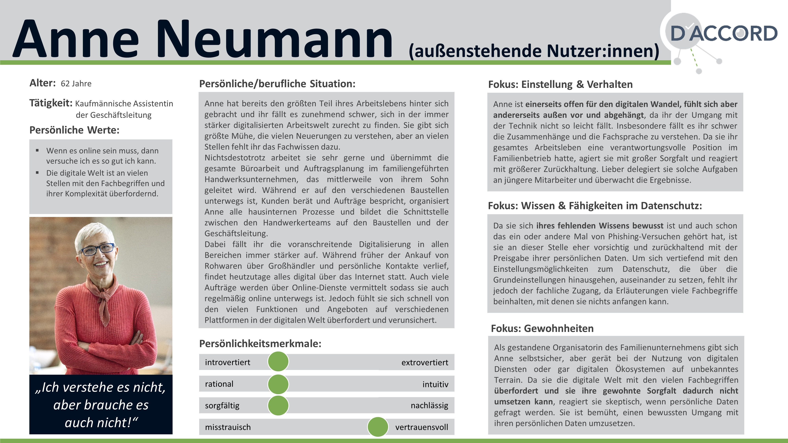

# Personas

Personas sind fiktive, archetypische Charaktere, die im Projekt entwickelt wurden, um die potenziellen Nutzerinnen und Nutzer eines DSC zu repräsentieren. Der Einsatz von Personas ist eine effektive Methode, um das Verhalten und die Bedürfnisse von Nutzerinnen und Nutzern besser zu verstehen und auf dieser Grundlage Produkte und Dienstleistungen zu entwickeln, die den Anforderungen und Erwartungen der Nutzenden entsprechen.

Personas ermöglichen eine differenzierte Auseinandersetzung mit den Fähigkeiten, Bedürfnissen und Erwartungen unterschiedlicher Nutzergruppen. Sie haben sich als wertvolles Instrument der Nutzeranalyse etabliert, da sie dazu beitragen, unterschiedliche, relevante Nutzertypen griffig zu charakterisieren und sich in ihre Perspektive hineinzuversetzen.

Der Hauptzweck von Personas besteht dabei darin, abstrakte Nutzerklassen durch konkrete und lebensnahe Beschreibungen zu ersetzen. Dazu enthalten sie präzise Informationen wie Ziele, Fähigkeiten, Kenntnisse, Präferenzen und Verhaltensweisen typischer Nutzerinnen und Nutzer. Diese Beschreibungen enthalten darüber hinaus oft Details wie Name, Geschlecht, Alter, Familienstand, Sprachkenntnisse, Ausbildung, Beruf, Fachwissen, Interessen.

Die Entwicklung und Verwendung von Personas kann helfen, besser zu verstehen, wie verschiedene Nutzergruppen Informationen aufnehmen und verstehen (Neues erlernen). Dies trägt wesentlich zur Gestaltung gebrauchstauglicher Datenschutzfunktionen bei, die die digitale Souveränität der Nutzerinnen und Nutzer stärken und ihre digitalen Kompetenzen fördern. Ausgangspunkt ist häufig eine Analyse der Nutzerinnen und Nutzer eines Produkts oder einer Dienstleistung, auf deren Basis (mehrere) Personas entwickelt werden. Diese repräsentieren dann typische Kombinationen von Nutzereigenschaften und helfen den Entwicklern die Fähigkeiten und Kompetenzen verschiedener Gruppen besser einschätzen zu können.

Im vorliegenden Fall könnten die Extreme z.B. durch die Persona einer Person repräsentiert werden, die wenig Erfahrung oder Motivation hat, ihre Datensouveränität durchzusetzen und einer anderen Persona mit besonders ausgeprägter digitaler Kompetenz darstellt, für die Datenschutz überdies ein zentrales Anliegen ist. Dieser Ansatz ist etabliert und wird unter anderem in den Arbeiten von Dupree et al. (2016), Mettler/Wulf (2019) und Schomakers et al. (2018) hervorgehoben.

Im Projektkontext wurden Privacy Personas auf Basis der Verbrauchertypen des vom Bundesministerium des Innern und für Heimat (BMI) geförderten gemeinnützigen Bündnisses "Deutschland sicher im Netz e.V." (DsiN) entwickelt. Diese Personas decken die Bandbreite der Bedürfnisse und Kompetenzen deutscher Internetnutzerinnen und –nutzer in Bezug auf Informationssicherheit ab und waren nicht nur im Kontext digitaler Ökosysteme in Deutschland, sondern insbesondere bereits für die Konzeption der gebrauchstauglichen Datenschutzfunktionen des DSC relevant. 

Folgende Personas wurden im Projekt entwickelt:

## Außenstehende Nutzer

Anne N. - die Außenstehende: 62 Jahre, Internetnutzung < 20 Stunden/Woche, bevorzugt Laptop. Sie hat wenig Wissen über Datenschutz und Privatsphäre und fühlt sich von den Möglichkeiten oft überfordert. Datenschutzerklärungen liest sie nur gelegentlich, da sie viele Fachbegriffe nicht versteht.

## Fatalistische Nutzer

Frank N. - der Fatalist: 21 Jahre, Internetnutzung 10-30 Stunden/Woche, nutzt Laptop, Desktop oder Smartphone. Er hat ein geringes Bewusstsein für Datenschutz und Privatsphäre und konzentriert sich auf den praktischen Nutzen von Anwendungen, denen er in Bezug auf Datenschutzmaßnahmen wenig vertraut.

## Gutgläubige Nutzer:innen

Greta N. - die Gutgläubige: 28 Jahre alt, nutzt das Internet 10-20 Stunden/Woche, bevorzugt Laptop oder Smartphone. Sie hat großes Vertrauen in die Anbieter und liest selten Datenschutzerklärungen oder passt ihre Privatsphäre-Einstellungen an.

## Antreibende Nutzer:innen

Arne N. – der Antreiber: 46 Jahre, Internetnutzung 10-30 Stunden/Woche, bevorzugt mobile Geräte. Er ist sich der Bedeutung des Datenschutzes bewusst und prüft neue Plattformen erst nach gründlicher Lektüre der Datenschutzerklärungen.

## Bedachtsame Nutzer:innen

Bernd N. - der Vorsichtige: 54 Jahre, Internetnutzung 10-30 Stunden/Woche, bevorzugt mobile Geräte. Für ihn steht die Sicherheit seiner persönlichen Daten an erster Stelle. Er liest Datenschutzerklärungen genau, um seine Einstellungen zu optimieren.

****

| [ Stakeholder](<Stakeholder>) | [Mentale Modelle ](<Mentale Modelle>) |

****

**Quellen** 

Dehling, F., Ludborzs, S., Weßner, A. et al. Konzepte für gebrauchstaugliche Datenschutzfunktionen in digitalen Ökosystemen. Datenschutz Datensich 48, 95–102 (2024), S. 2f. https://doi.org/10.1007/s11623-023-1888-4