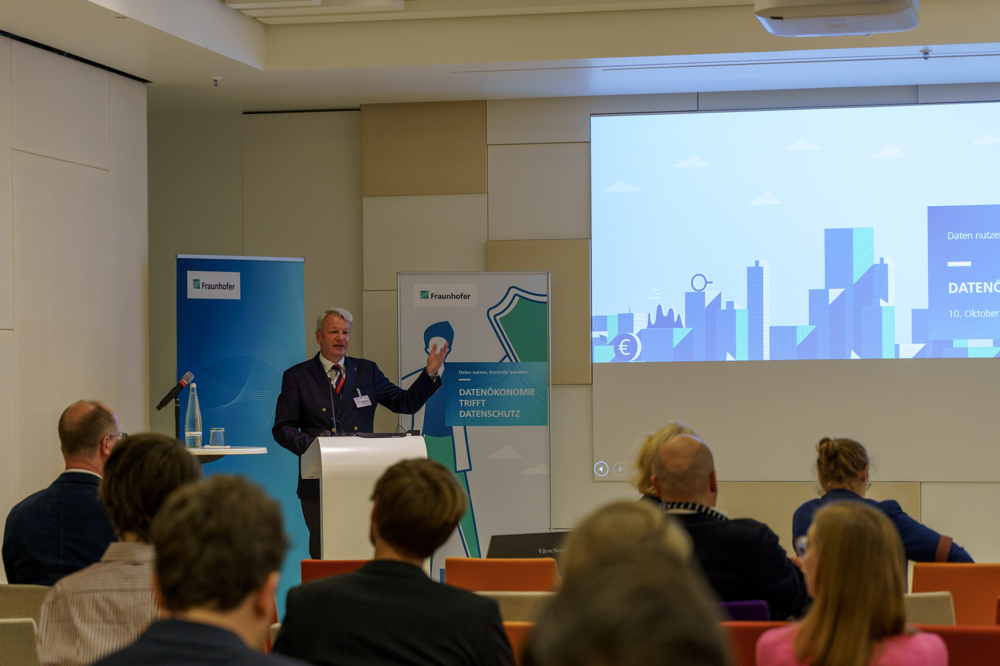
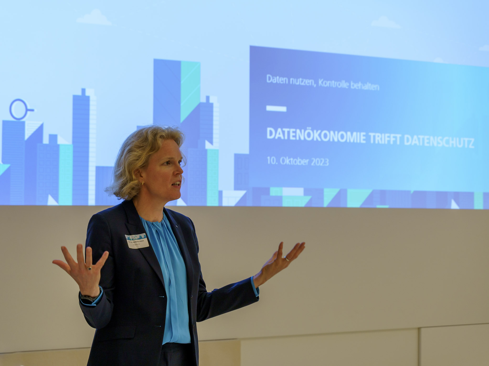
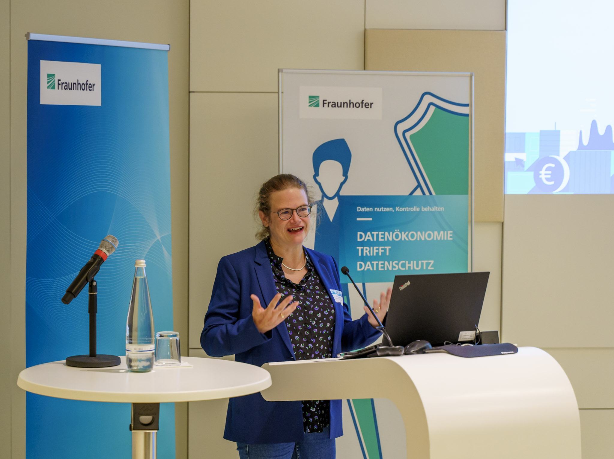
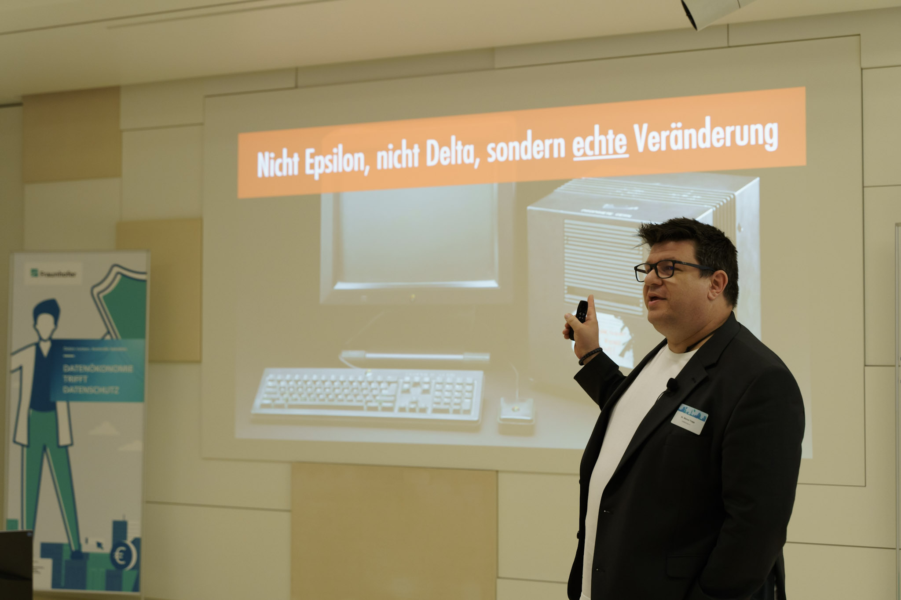
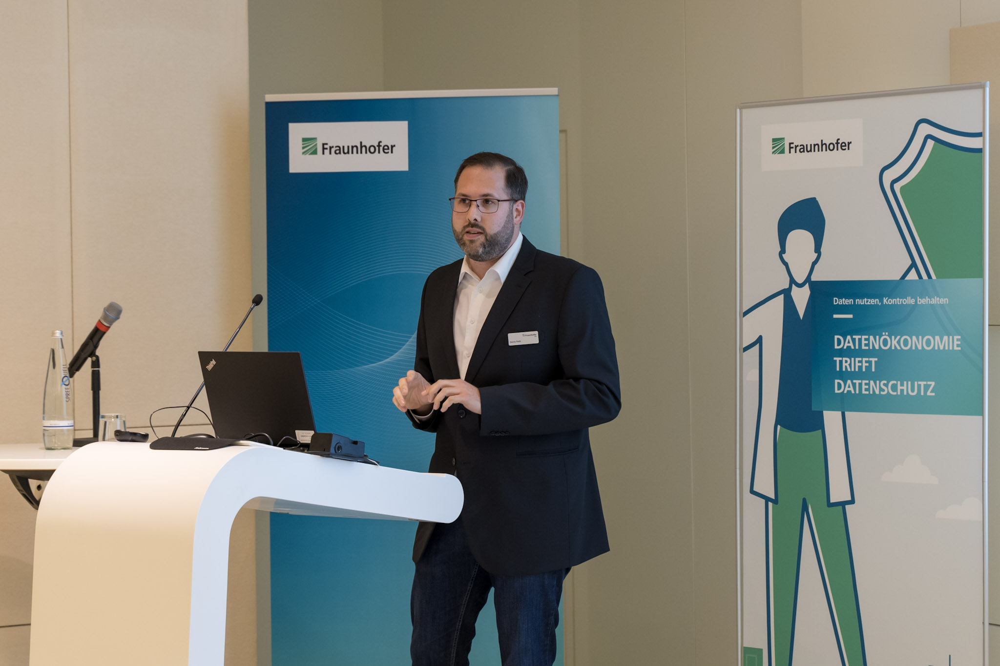
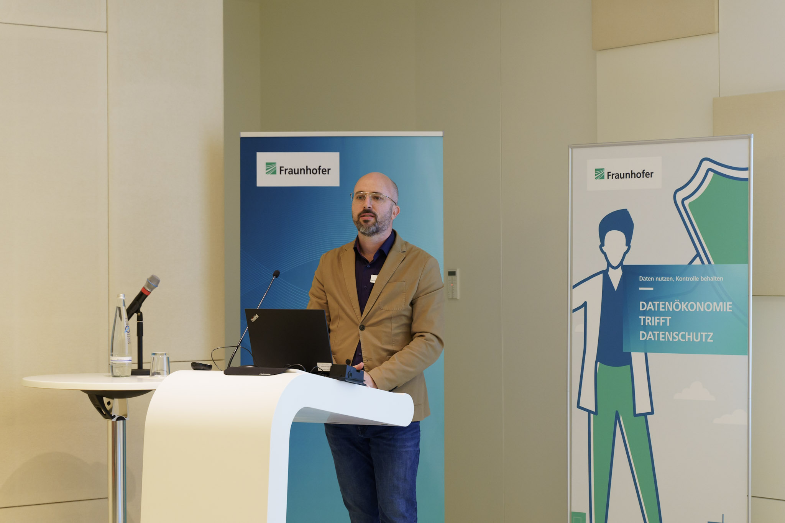
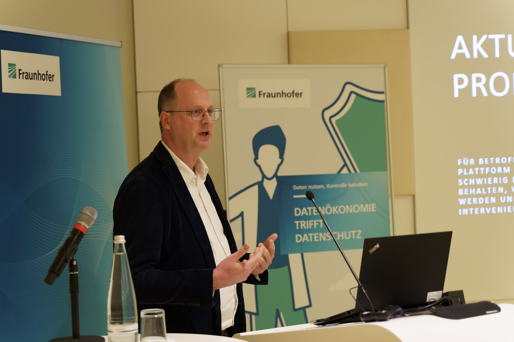
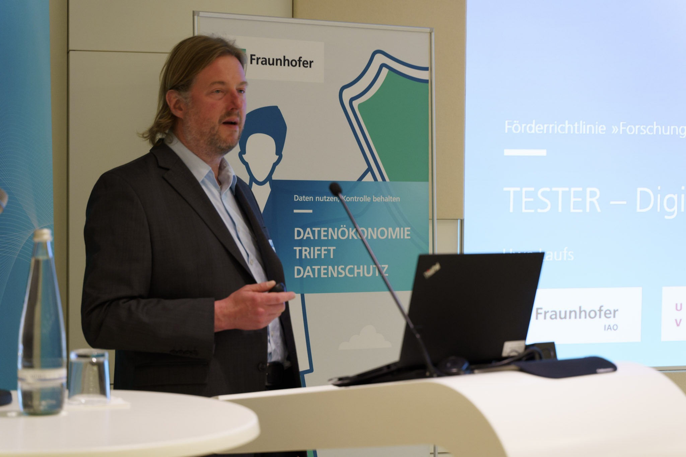
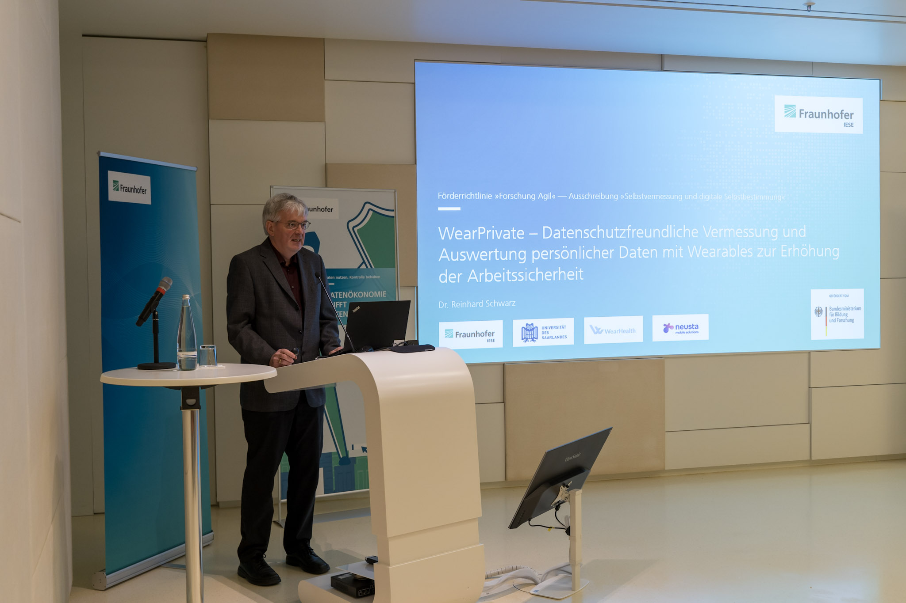
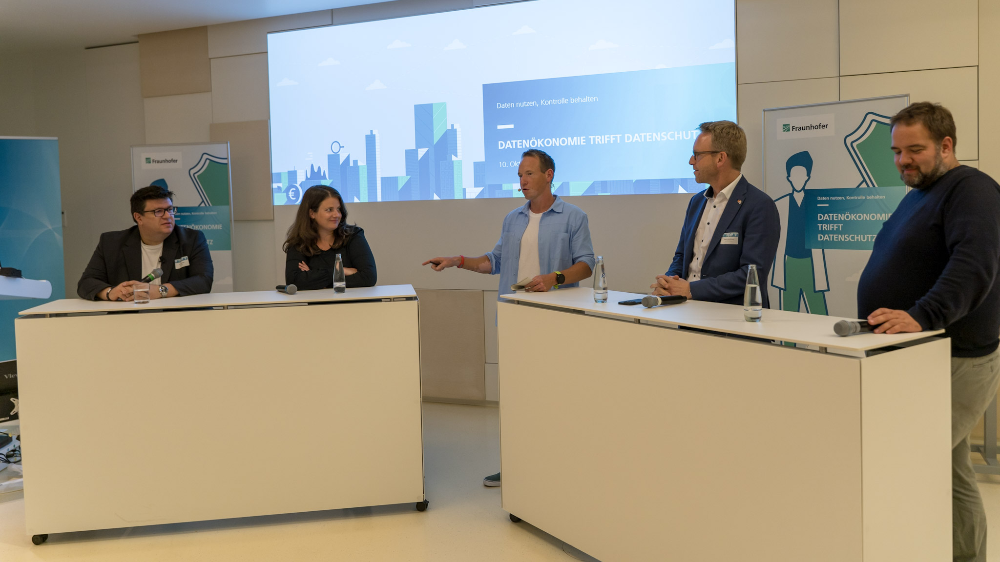

<link rel="stylesheet" href="/Daccord/assets/css/slideshow.css">

# Unsere Veranstaltungen

## Netzwerkveranstaltung "Datenökonomie trifft Datenschutz"

- **Kurzbeschreibung:** Der stetige Zuwachs an digitalen Ökosystemen geht auch mit steigenden Anforderungen an Datenschutz und Datensouveränität einher. Denn die meisten Geschäftsmodelle rund um digitale Ökosysteme und Plattformökonomien erfordern den Austausch personenbezogener und anderer sensibler Daten. In einer zweistündigen Abendveranstaltung drehte sich alles um das Thema "Datenökonomie trifft Datenschutz". Das Programm setzte sich aus einer Begrüßung des BMBF, einer Keynote von FullFlamingo.cc, Pitches der Projekte [D’accord](https://www.daccord-projekt.de/), [KickStartTrustee](http://www.kickstarttrustee.de/), [PERISCOPE](http://www.periscope-projekt.de/), [TESTER](https://www.tester-projekt.de/) und [WearPrivate](https://www.wearprivate.de/) sowie einer politischen Podiumsdiskussion zusammen.
- **Ort:** Fraunhofer Forum Berlin
- **Zeit:** 10. Oktober 2023
- **Link:** [https://www.iese.fraunhofer.de/de/veranstaltungen_messen/2023/datenschutzoekonomie2023.html](https://www.iese.fraunhofer.de/de/veranstaltungen_messen/2023/datenschutzoekonomie2023.html)

  

    
1 / 10

    
    
Prof. Dr. Peter Liggesmeyer (Fraunhofer IESE) erf&ouml;ffnet die Veranstaltung. &copy; Fraunhofer IESE

  

  

    
2 / 10

    
    
Prof. Dr. Katharina H&ouml;lzle (Fraunhofer IAO) erf&ouml;ffnet die Veranstaltung. &copy; Fraunhofer IESE

  

  

    
3 / 10

    
    
Bettina Klingbeil (BMBF) spricht Gru&szlig;worte aus Sicht des F&ouml;rdermittelgebers. &copy; Fraunhofer IESE

  

  
 

    
4 / 10

    
    
Dr. Marcus Trapp (FullFlamingo) h&auml;lt die Keynote zum Thema Digitale &Ouml;kosysteme und Plattform&ouml;konomie. &copy; Fraunhofer IESE

  

  

    
5 / 10

    
    
Denis Feth (Fraunhofer IESE) stellt das Projekt D'accord vor. &copy; Fraunhofer IESE

  

  
  

    
6 / 10

    
    
Bernd Rauch (Fraunhofer IESE) stellt das Projekt KickStartTrustee vor. &copy; Fraunhofer IESE

  

  
  

    
7 / 10

    
    
Christian Schunck (Fraunhofer IAO) stellt das Projekt PERISCOPE vor. &copy; Fraunhofer IESE

  

  
  

    
8 / 10

    
    
Uwe Laufs (Fraunhofer IAO) stellt das Projekt TESTER vor. &copy; Fraunhofer IESE

  

  
  

    
9 / 10

    
    
Dr. Reinhard Schwarz (Fraunhofer IESE) stellt das Projekt WearPrivate vor. &copy; Fraunhofer IESE

  

  
  

    
10 / 10

    
    
Podiumsdiskussion mit Dr. Marcus Trapp (FullFlamingo), Ann Cathrin Riedel (LOAD e.V.), Gerald Swarat (Fraunhofer IESE, Moderation), Marc Henrichmann (CDU) und Malte Spitz (Bündnis 90 / Die Grünen) (v.l.n.r.) &copy; Fraunhofer IESE

  

    
  <a class="prev" onclick="plusSlides(-1)">&#10094;</a>
  <a class="next" onclick="plusSlides(1)">&#10095;</a>

  
  
  
  
  
  
  
  
  
  

## Usable Security and Privacy Workshops auf der Mensch und Computer**

Der Workshop "Usable Security und Privacy" wird seit 2015 im Rahmen der [Mensch und Computer (MuC)](https://fb-mci.gi.de/aktivitaeten/tagungsreihe-mensch-und-computer/) durchgeführt. Ziel ist es, einen Austausch von   Expert:innen aus Wissenschaft und Praxis zum Thema benutzerfreundlicher Technologien zur Gewährleistung der Informationssicherheit und Privatheit zu ermöglichen und weiterzuentwickeln. Zugleich soll durch den Workshop die Diskussion für ein breiteres Fachpublikum geöffnet werden. 

### 10. Usable Security and Privacy Workshop

- **Kurzbeschreibung:** Ziel der zehnten Ausgabe des wissenschaftlichen Workshops “Usable Security und Privacy” auf der Mensch und Computer 2024 ist es, aktuelle Forschungs- und Praxisbeiträge auf diesem Gebiet zu präsentieren und mit den Teilnehmer:innen zu diskutieren. Getreu dem Konferenzmotto “Hybrid Worlds” soll mit dem Workshop ein etabliertes Forum fortgeführt und weiter
entwickelt werden, in dem sich Expert:innen, Forscher:innen und Praktiker:innen aus unterschiedlichen Domänen transdisziplinär zum Thema Usable Security und Privacy austauschen können. Das Thema betrifft neben dem Usability- und Security-Engineering unterschiedliche Forschungsgebiete und Berufsfelder, z. B. Informatik, Ingenieurwissenschaften, Mediengestaltung und Psychologie. Der Workshop richtet sich an interessierte Wissenschaftler:innen aus all diesen Bereichen, aber auch ausdrücklich an Vertreter:innen der Wirtschaft, Industrie und öffentlichen Verwaltung.
- **Ort:** Karlsruher Institut für Technologie
- **Zeit:** 03. September 2024
- **Call for Paper:** [https://das.h-brs.de/workshops/usp-muc-2024/](https://das.h-brs.de/workshops/usp-muc-2024/)
- **Publikation:**: Noch nicht veröffentlicht.

### 9. Usable Security and Privacy Workshop

- **Kurzbeschreibung:** Ziel der neunten Ausgabe des wissenschaftlichen Workshops “Usable Security und Privacy” auf der Mensch und Computer 2023 ist es, aktuelle Forschungs- und Praxisbeiträge auf diesem Gebiet zu präsentieren und mit den Teilnehmer:innen zu diskutieren. Getreu des Konferenzmottos “Building Bridges” soll mit dem Workshop ein etabliertes Forum fortgeführt und weiterentwickelt werden, in dem sich Expert:innen, Forscher:innen und Praktiker:innen aus unterschiedlichen Domänen transdisziplinär zum Thema Usable Security und Privacy austauschen können. Das Thema betrifft neben dem Usability- und SecurityEngineering unterschiedliche Forschungsgebiete und Berufsfelder, z. B. Informatik, Ingenieurwissenschaften, Mediengestaltung und Psychologie. Der Workshop richtet sich an interessierte Wissenschaftler:innen aus all diesen Bereichen, aber auch ausdrücklich an Vertreter:innen der Wirtschaft, Industrie und öffentlichen Verwaltung.
- **Ort:** Ostschweizer Fachhochschule Campus Rapperswil, Schweiz
- **Zeit:** 03. September 2023
- **Call for Paper:** [https://das.h-brs.de/workshops/usp-muc-2023/](https://das.h-brs.de/workshops/usp-muc-2023/)
- **Publikation:**: [https://dl.gi.de/server/api/core/bitstreams/222dcf44-7c3e-4f17-b044-b4e0199a0e48/content](https://dl.gi.de/server/api/core/bitstreams/222dcf44-7c3e-4f17-b044-b4e0199a0e48/content)

### 8. Usable Security and Privacy Workshop

- **Kurzbeschreibung:** Ziel der achten Auflage des wissenschaftlichen Workshops “Usable Security and Privacy” auf der Mensch und Computer 2022 ist es, aktuelle Forschungs- und Praxisbeiträge zu präsentieren und anschließend mit den Teilnehmenden zu diskutieren. Der Workshop soll ein etabliertes Forum fortführen und weiterentwickeln, in dem sich Experten aus verschiedenen Bereichen, z. B. Usability und Security Engineering, transdisziplinär austauschen können.
- **Ort:** Technische Universität Darmstadt
- **Zeit:** 04. September 2022
- **Call for Paper:** [https://das.h-brs.de/workshops/usp-muc-2022/](https://das.h-brs.de/workshops/usp-muc-2022/)
- **Publikation:** [https://dl.gi.de/server/api/core/bitstreams/db54ade5-e47c-418a-b220-fa27dc14826d/content](https://dl.gi.de/server/api/core/bitstreams/db54ade5-e47c-418a-b220-fa27dc14826d/content)

### 7. Usable Security and Privacy Workshop

- **Kurzbeschreibung:** Auch die mittlerweile siebte Ausgabe des wissenschaftlichen Workshops “Usable Security und Privacy” auf der Mensch und Computer 2021 wird aktuelle Forschungs- und Praxisbeiträge präsentiert und anschließend mit allen Teilnehmer:innen diskutiert. Zwei Beiträge befassen sich dieses Jahr mit dem Thema Privatsphäre, zwei mit
dem Thema Sicherheit. Mit dem Workshop wird ein etabliertes Forum fortgeführt und weiterentwickelt, in dem sich Expert:innen
aus unterschiedlichen Domänen, z. B. dem Usability- und SecurityEngineering, transdisziplinär austauschen können.
- **Ort:** Technische Hochschule Ingolstadt
- **Zeit:** 05. September 2021
- **Call for Paper:** [https://das.h-brs.de/workshops/usp-muc-2021/](https://das.h-brs.de/workshops/usp-muc-2021/)
- **Publikation:** [https://dl.gi.de/server/api/core/bitstreams/a2a556ba-081a-4f47-895a-6b831ff7af32/content](https://dl.gi.de/server/api/core/bitstreams/a2a556ba-081a-4f47-895a-6b831ff7af32/content)