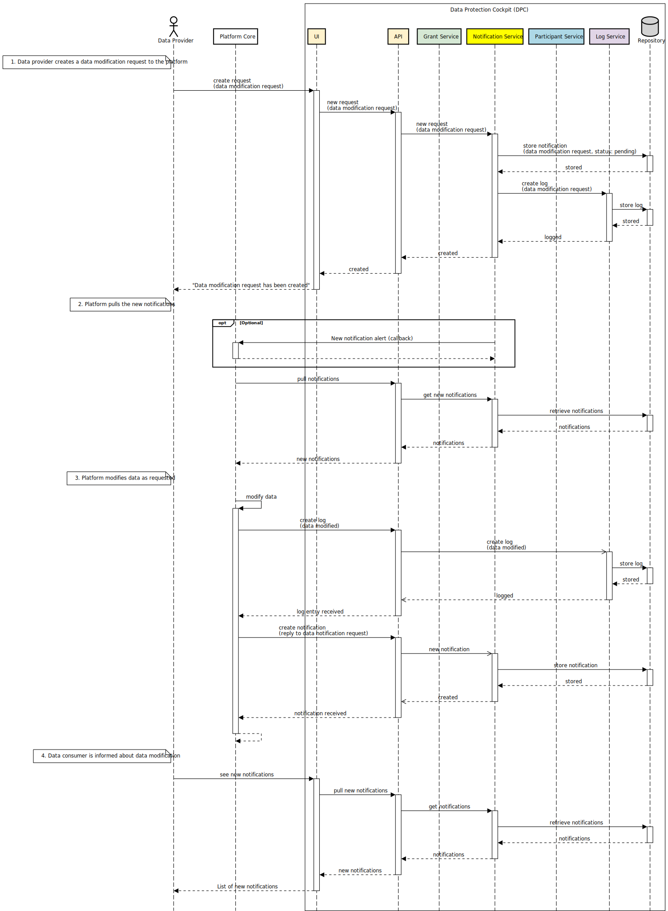

1. [Introduction](index.md)
2. [System context and domain model](system-context.md)
3. [Architecture drivers](drivers.md)
4. System decomposition
5. [Quality concepts](quality.md)
6. [Further notes](conclusion.md)

# System decomposition

# Structure

The figure below features the <kbd>Data Intermediation Platform</kbd> composed of two elements: the <kbd>Platform Core</kbd> and the <kbd>DPC</kbd>. On the left side, a human actor represents a _data provider_; on the right side, an external third-party system and its user compose the _data consumer_. The data provider sends data assets to, and the data provider gets data assets from, the platform core. That means that the flow of the data assets happens via the core platform and does not belong to the scope of the DPC (note the _data asset flow_ area in the figure). The DPC contributes to the data flow, though, for the information about grants is managed by the DPC. Therefore, the platform core must check the DPC for grant information before forwarding data assets to a data consumer.

## Layers

Internally, the compositing components of the DPC are organized into three layers: 

- <kbd>Interface</kbd> contains the components responsible for interfacing the DPC with the external world;
- <kbd>Service</kbd> contains the components that implement the functionalities of the DPC; and
- <kbd>Repository</kbd> contains the components responsible for managing DPC's data storage.

## DPC's internal components

The next figure further decomposes the DPC component and features the external and internal dependencies among components in the ecosystem. In this representation, we colored the components <kbd>Participant Service</kbd>, <kbd>Log Service</kbd>, <kbd>Notification Service</kbd>, and <kbd>Grant Service</kbd> matching the corresponding areas in the [domain model](system-context.md#domain-model).

**There are two components in the interface layer:**

- The <kbd>UI</kbd> component is responsible for implementing the DPC's user interface (UI) and user experience (UX). Additional details regarding this can be found on the [UX Design page](../UX-Design/index.md). It is dependent on the **API** component for its functionality.
> For example, the <kbd>UI</kbd> component can be implemented as a Single-Page Application using React that interacts with DPC's backend through a RESP API.
- The <kbd>API</kbd> component is responsible for exposing the internal functionality of the DPC to the UI and external components. It depends on the <kbd>Grant Service</kbd>, <kbd>Log Service</kbd>, and <kbd>Notification Service</kbd> components, as these components provide the actual functionalities of the DPC.

**The service layer contains four components:**

- The <kbd>Grant Service</kbd> component is responsible for managing the storage of all data necessary to handle grant permissions.
    - Exposed functionalities:
        - create grant requests, approve grant requests, retrieve grants, and revoke grants;
        - create, retrieve, update, and delete data types;
        - create, retrieve, update, and delete legal base;
        - create, retrieve, update, and delete data usage purposes;
        - create, retrieve, update, and delete data privileges required by data consumers (see entity _Consumer Usage Purpose_ in the [domain model](system-context.md));
    - Dependencies: This component depends on <kbd>Log Service</kbd> for logging all grant-related operations and <kbd>Participant Service</kbd> for connecting two participants (a data provider and a data consumer).

- The <kbd>Notification Service</kbd> component is responsible for creating and searching notifications of all types, such as grant requests, information, and confirmations.
    - Exposed functionalities:
        - create notifications of several types (e.g., information, confirmation, warning, risk) from one participant to another;
        - create requests of several types (e.g., data deletion request, data report request, grant request -- the interplay between <kbd>Grant Service</kbd> and <kbd>Notification Service</kbd> on the creation of grant request is detailed in the section "Behavior") from one participant to another;
    - Dependencies: It depends on the <kbd>Log Service</kbd> to log notifications to ensure proper tracking and record-keeping.
 

- The <kbd>Log Service</kbd> component is responsible for logging all operations within the DPC, mainly focusing on activities related to grants and notifications. It is worth noting that not only <kbd>Grant Service</kbd> and <kbd>Notification Service</kbd> depend on it (to create logs concerning grants and notifications, respectively), but the <kbd>API</kbd> also depends on it because there are data-related events of interest (i.e., which should be logged) that happen in the <kbd>Platform Core</kbd>, not in the DPC -- a prominent example is the occurrence of a data flow.
    - Exposed functionalities:
        - create log entry for any arbitrary operation;
        - retrieve log entries.

    
- The <kbd>Participant Service</kbd> component maintains a record of existing participants, including data providers and data consumers, within the <kbd>Platform Core</kbd>.
    - Exposed functionalities:
        - create, retrieve, update, and delete participants (which are informed by the <kbd>Platform Core</kbd>).

# Behavior

This section contains behavioral diagrams depicting the interaction among DPC components, the <kbd>Platform Core</kbd>, data consumers, and data providers when performing key actions.

<!--
- grant request, interplay between grant and notification services
- data flow, including authorization (grant verification) and log
-->

## Create data update request

This interaction is depicted in four steps:

1. A data provider requests the platform owner to update personal data.
2. The platform pulls the request notification
3. The platform modifies the data as requested
4. The data provider is notified about the update of their data.

These steps are enumerated in the sequence diagram below.

> **A note on logs:** Events that are relevant to the DPC can happen inside and outside the DPC. For example, consider a grant authorization flow: As the data involved is managed via the DPC (grant requests, approvals, revocations, etc.), all logs concerning the grant authorization flow can be created internally (e.g., <kbd>Grant Service</kbd> calls the <kbd>Log Service</kbd> whenever necessary). When it comes to modification of personal data, this happens outside the DPC: the <kbd>Platform Core</kbd> is responsible for storing data providers' personal data. Therefore, in these cases, the <kbd>Platform Core</kbd> must inform the DPC via its <kbd>API</kbd> component.

> **Getting notified:** Participants send notifications to each other, where each notification comprises two participants: a sender (or originator) and a recipient (or destination). When the notification involves a data provider and a data consumer, both participants interact with the DPC via the <kbd>UI</kbd> component. Therefore, these participants can see their new notifications on screen by accessing the DPC's user interface. However, there are more possibilities when the notification involves the platform owner (e.g., the data provider requests the platform owner to update their data). Certain predefined types of notifications can be processed by the <kbd>Platform Core</kbd> automatically, whereas generic requests may require human intervention. When a notification is created by the <kbd>Platform Core</kbd>, the sender calls an operation exposed by the <kbd>API</kbd> to create the notification in the DPC; when a notification is created by another participant, the <kbd>Platform Core</kbd> must pull the notification from the DPC, which can be done via an operation exposed by the <kbd>API</kbd>. Concrete implementations of the pulling can vary, depending on the concrete architecture and requirements of the concrete platform. The sequence diagram below features an optional callback function through which the DPC could inform the <kbd>Platform Core</kbd> about a new notification, which could be employed in scenarios involving time-sensitive messages.

## Create incident notification

TODO: consider case when the destination is not clear (e.g., the data consumer wants to notify all its data providers without naming the individual data providers).

This interaction is depicted in four steps:

1. A data provider requests the platform owner to update personal data.
2. The platform pulls the request notification
3. The platform modifies the data as requested
4. The data provider is notified about the update of their data.

These steps are enumerated in the sequence diagram below.

    <a href="drivers.md">Previous: 3. Architecture drivers</a>&nbsp; | &nbsp;<a href="quality.md">Next: 5. Quality concepts</a>

