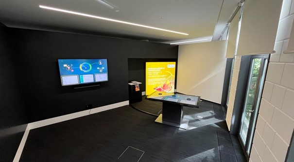
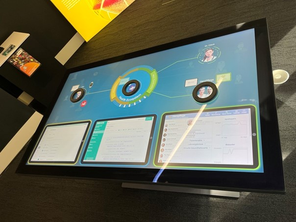

# Digitale Gesundheitsplattform

## Hintergrund

Im Zentrum des Demonstrators steht eine digitale Plattform, die den sicheren Austausch von Gesundheitsdaten zwischen Patienten und medizinischem Fachpersonal ermöglicht. Ein integraler Bestandteil dieser Plattform ist das Datenschutz-Cockpit, welches Patienten Transparenz über die Datenverarbeitung bietet und ihnen erlaubt, ihre Datenschutzrechte aktiv wahrzunehmen. Durch das Cockpit können sie nicht nur Einblicke in die Nutzung ihrer Daten erhalten, sondern auch gezielt Freigaben erteilen oder einschränken. Gleichzeitig haben auch Datennutzer, wie Ärzte oder Pflegedienste, über das Cockpit Zugriff auf maßgeschneiderte Ansichten, die ihre Datenanforderungen regeln.

Das Datenschutz-Cockpit ist eng mit der Sicherheitslösung "MYDATA" verknüpft, die die getroffenen Einstellungen automatisch umsetzt und eine feingranulare Kontrolle der Datenverarbeitung sicherstellt.

Der Demonstrator zeigt folgende zentrale Abläufe, gestützt durch unser Datenschutz-Cockpit:

- Ein Pflegedienst stellt eine gezielte Datenanfrage an den Patienten.
- Der Patient gibt seine Gesundheitsdaten für den Pflegedienst frei.
- Der Pflegedienst wird über die neuen freigegebenen Daten informiert.
- Der Patient bearbeitet die Datenfreigabe und schränkt die Datenverarbeitung ein.
- Die Sicherheitslösung MYDATA maskiert die Daten gemäß den im Datenschutz-Cockpit festgelegten Vorgaben.
- Der Pflegedienst ändert seine Datenschutzerklärung.
- Der Patient verlangt eine Datenauskunft nach DSGVO Art. 15.
- Es tritt eine Notfallsituation auf, die eine Abwägung zwischen Datenschutz und Gesundheit erfordert.

## Demonstrator

<video src="Demonstrator_IESE_Health.mp4" controls="controls" style="max-width: 960px;"></video>

## Einbettung in den IESE-Demo-Bereich

Das Fraunhofer IESE betreibt einen Demo-Bereich, in dem wissenschaftliche Erkenntnisse und Produkte des Instituts für interessierte Besucher aus Wissenschaft, Wirtschaft und Politik anfassbar demonstriert werden. Dieser Demo-Bereich besteht aus mehreren "Kuben", die sich jeweils einem konkreten Schwerpunktthema widmen, darunter der Kubus "Datensouveränität und Cybersicherheit". In diesem Kubus wird der hier beschriebene Demonstrator auf einem interaktiven Touch-Tisch gezeigt. Die folgenden Fotos vermitteln einen Eindruck des aktuellen Zustandes.

****

| [ Smarte.Land.Regionen](<Smarte.Land.Regionen>) | [Kommunikationsplattform für Unternehmen ](../Kommunikationsplattform) |

****
