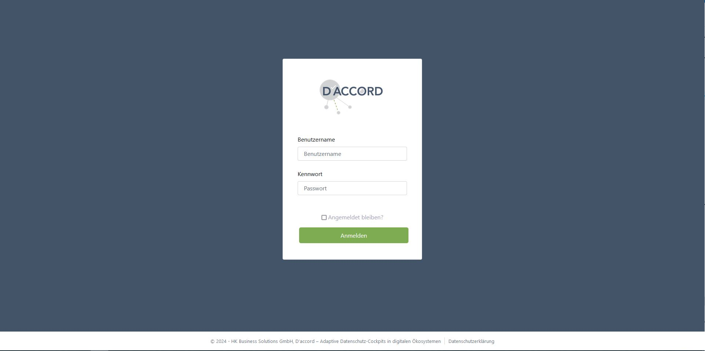

# Kommunikationsplattform für Unternehmen

Bei der elektronischen Kommunikation und Zusammenarbeit von IT-Unternehmen mit Partnern, Kunden und Lieferanten werden in der Regel intensiv personenbezogene Daten ausgetauscht, an Dritte weitergegeben werden oder bei Cloud-Diensten gespeichert. Für die Betroffenen, z. B. Mitarbeiter in den beteiligten Unternehmen, ist dies oft nicht transparent und sie haben keine Möglichkeit, steuernd in die Datenverarbeitung einzugreifen.

Ziel dieses Anwendungsbeispiels war es, die D’accord-Konzepte und die adaptive Werkzeugsammlung in dem konkreten Unternehmenskontext der HK Business Solutions zu erproben. Während der gesamten Umsetzungskette wurde mit Zielgruppenvertretern aus Kunden- und Partnerunternehmen zusammengearbeitet, die sich als assoziierte Partner am D’accord-Projekt beteiligten.

## Rahmenbedingungen

- Umsetzung des Datenschutz-Cockpits in Form einer Internetanwendung
- Einsatz etablierter, verbreiteter Web-Technologien und Werkzeuge, wie sie von der HKBS auch bei der Softwareentwicklung in Kundenprojekten bzw. internen Projekten genutzt werden
  - C# – objektorientierte Programmiersprache
  - ASP.NET – Framework zur Entwicklung von Webanwendungen
  - HTML, CSS, JavaScript – Entwicklung webbasierter Benutzeroberflächen
  - MS Visual Studio – Entwicklungsumgebung
  - Team Foundation Server – Quellcodeverwaltung, Versionierung
  - MS SQL Management Studio – Datenbank-Verwaltung
- Einbindung von Zielgruppenvertretern während der gesamten Umsetzungskette (Ermittlung von Anforderungen an ein Datenschutz-Cockpit, Feedback zu Zwischenergebnissen, abschließende Evaluation des funktionsfähigen Demonstrators)

## Ablauf

Im Rahmen der Anforderungserhebung an das Datenschutz-Cockpit wurden bei der HK Business Solutions interne Workshops durchgeführt. Anschließend wurden Experteninterviews mit Vertretern aus vier Kundenunternehmen geführt. Auf diese Weise wurden insgesamt 50 Anwendungsfälle identifiziert (siehe Beispiele in den Abbildungen), die den Funktionsumfang definierten:

Als wichtigste Akteure für die Anwendungsfälle wurden identifiziert:

- Datennutzer: alle Personen bei der HKBS und anderen Organisationen (z. B. Kunden, Partnerunternehmen, Lieferanten), die personenbezogene Daten verwenden
- Admin: kümmert sich um die Administration des Datenschutz-Cockpits
- Content-Manager: kümmert sich um die inhaltliche Pflege des Datenschutz-Cockpits
- Betroffene: alle Personen bei anderen Organisationen, deren personenbezogene Daten erhoben bzw. verarbeitet werden

Zudem wurde entschieden, welche Betroffenenrechte im Cockpit-Demonstrator umgesetzt werden sollten:

- Datenauskunft: der Betroffene kann sich informieren, welche personenbezogenen Daten bzw. Datenkategorien, von wem und zu welchem Zweck erhoben bzw. verarbeitet werden
- Datenkorrektur: der Betroffene kann falsche/veraltete Daten berichtigen (lassen)
- Datenlöschung: der Betroffene kann nicht mehr benötigte Daten löschen (lassen)
- Datenexport: der Betroffene kann alle personenbezogenen Daten, die ihn selbst betreffen, sowohl in einem menschenlesbaren Format als auch in einem maschinenlesbaren Format exportieren

Im Anschluss an die Konzepterstellung und die Durchführung einer technischen Machbarkeitsstudie erfolgte die technische Implementierung des Demonstrators für das Anwendungsszenario der HKBS. Die Ausarbeitung fand inkrementell statt, Zwischenstände wurden regelmäßig intern und mit den Projektpartnern abgestimmt. Auf Basis des Feedbacks der Zielgruppenvertreter wurden neue Funktionen hinzugefügt, Umstrukturierungen und Umbenennungen vorgenommen und neue Menüpunkte ergänzt.

## Demonstrator des Datenschutz-Cockpits

### Interaktion im Datenschutz-Cockpit (Video)
(Stand: August 2024)

<video src="Daccord-Cockpit_HKBS.mp4" controls="controls" style="max-width: 960px;"></video>

### Benutzeroberfläche des Datenschutz-Cockpits (Slideshow)
(Stand: August 2024)

  

    
1 / 29

    
    
Login-Screen des Datenschutz-Cockpits. &copy; HK Business Solutions GmbH

  

  
  

    
2 / 29

    
    
Startseite des Datenschutz-Cockpits. &copy; HK Business Solutions GmbH

  

  
  

    
3 / 29

    
    
Datenschutz-Glossar mit allgemeinverständlichen Erklärungen datenschutzrelevanter Begriffe und Verweisen auf relevante Quellen. &copy; HK Business Solutions GmbH

  

  
  

    
4 / 29

    
    
Beispieleintrag im Datenschutz-Glossar. &copy; HK Business Solutions GmbH

  

  
  

    
5 / 29

    
    
Übersicht “Datenschutz bei HKBS”. &copy; HK Business Solutions GmbH

  

  
  

    
6 / 29

    
    
Richtlinien u. ä., die den Umgang mit personenbezogenen Daten im digitalen Ökosystem regeln. &copy; HK Business Solutions GmbH

  

  
  

    
7 / 29

    
    
Beispiel für eine interne Richtlinie. &copy; HK Business Solutions GmbH

  

  
  

    
8 / 29

    
    
Verträge (insbesondere mit externen Datenverarbeitern), die den Umgang mit personenbezogenen Daten im digitalen Ökosystem regeln. &copy; HK Business Solutions GmbH

  

  
  

    
9 / 29

    
    
Maske zum Anlegen eines neuen Vertrags. &copy; HK Business Solutions GmbH

  

  
  

    
10 / 29

    
    
Audits/Reviews – Übersicht. &copy; HK Business Solutions GmbH

  

  
  

    
11 / 29

    
    
Maske zum Dokumentieren eines Datenschutz-Audits. &copy; HK Business Solutions GmbH

  

  
  

    
12 / 29

    
    
Durchgeführte Schulungen zum Umgang mit personenbezogenen Daten im digitalen Ökosystem. &copy; HK Business Solutions GmbH

  

  
  

    
13 / 29

    
    
Maske zum Dokumentieren einer Schulung. &copy; HK Business Solutions GmbH

  

  
  

    
14 / 29

    
    
Verarbeitungsverzeichnis – Übersicht. &copy; HK Business Solutions GmbH

  

  
  

    
15 / 29

    
    
Beispieleintrag im Verarbeitungsverzeichnis. &copy; HK Business Solutions GmbH

  

  
  

    
16 / 29

    
    
Verzeichnis der technischen und organisatorischen Maßnahmen (TOM). &copy; HK Business Solutions GmbH

  

  
  

    
17 / 29

    
    
TOM-Beispieleintrag. &copy; HK Business Solutions GmbH

  

  
  

    
18 / 29

    
    
Verzeichnis der Datenschutz-Folgenabschätzungen (DSFA). &copy; HK Business Solutions GmbH

  

  
  

    
19 / 29

    
    
Maske zum Dokumentieren einer DSFA. &copy; HK Business Solutions GmbH

  

  
  

    
20 / 29

    
    
Datenkategorien mit Beschreibung, Quelle, Zweck und Empfänger. &copy; HK Business Solutions GmbH

  

  
  

    
21 / 29

    
    
Dienste und Zwecke inkl. Rechtsgrundlagen. &copy; HK Business Solutions GmbH

  

  
  

    
22 / 29

    
    
Übersicht der eigenen personenbezogenen Daten. &copy; HK Business Solutions GmbH

  

  
  

    
23 / 29

    
    
Datenexport als PDF. &copy; HK Business Solutions GmbH

  

  
  

    
24 / 29

    
    
Einwilligungen und Anfragen. &copy; HK Business Solutions GmbH

  

  
  

    
25 / 29

    
    
Beispielanfrage. &copy; HK Business Solutions GmbH

  

  
  

    
26 / 29

    
    
HKBS-Meldungen zum Datenschutz. &copy; HK Business Solutions GmbH

  

  
  

    
27 / 29

    
    
Maske zum Erstellen einer neuen Meldung. &copy; HK Business Solutions GmbH

  

  
  

    
28 / 29

    
    
Administrationsoberfläche: Benutzerverwaltung. &copy; HK Business Solutions GmbH

  

  
  

    
29 / 29

    
    
Administrationsoberfläche: Rollenzuweisungen. &copy; HK Business Solutions GmbH

  

  <a class="prev" onclick="plusSlides(-1)">&#10094;</a>
  <a class="next" onclick="plusSlides(1)">&#10095;</a>

  
  
  
  
  
  
  
  
  
  
  
  
  
  
  
  
  
  
  
  
  
  
  
  
  
  
  
  
  

### Login-Screen und Startseite des Datenschutz-Cockpits

### Datenschutz-Glossar und Beispieleintrag
allgemeinverständliche Erklärungen datenschutzrelevanter Begriffe und Verweise auf relevante Quellen

### Übersicht "Datenschutz bei HKBS"

### Richtlinien und Beispiel
interne Richtlinien u. ä., die den Umgang mit personenbezogenen Daten im digitalen Ökosystem regeln

### Verträge und Maske zum Anlegen eines neuen Vertrags
Verträge (insbesondere mit externen Datenverarbeitern), die den Umgang mit personenbezogenen Daten im digitalen Ökosystem regeln

### Audits/Reviews und Maske zum Dokumentieren eines Datenschutz-Audits

### Schulungen und Maske zum Dokumentieren einer Schulung
durchgeführte Schulungen zum Umgang mit personenbezogenen Daten im digitalen Ökosystem

### Verarbeitungsverzeichnis und Beispieleintrag

### Verzeichnis der technischen und organisatorischen Maßnahmen, Beispieleintrag

### Verzeichnis der Datenschutz-Folgenabschätzungen und Maske zum Dokumentieren einer DSFA

### Übersichten der Datenkategorien, Dienste und Zwecke
Datenkategorien mit Beschreibung, Quelle, Zweck, Empfänger; Dienste und Zwecke inkl. Rechtsgrundlagen

### Übersicht der eigenen personenbezogenen Daten, Datenexport (als PDF)

### Einwilligungen und Anfragen, Beispielanfrage

### HKBS-Meldungen zum Datenschutz, Maske zum Erstellen einer neuen Meldung

### Administrationsoberfläche: Benutzerverwaltung und Rollenzuweisungen

****

| [ Digitale Gesundheitsplattform](<Digitale Gesundheitsplattform>) | [Bewertung ](../Bewertung) |

****
