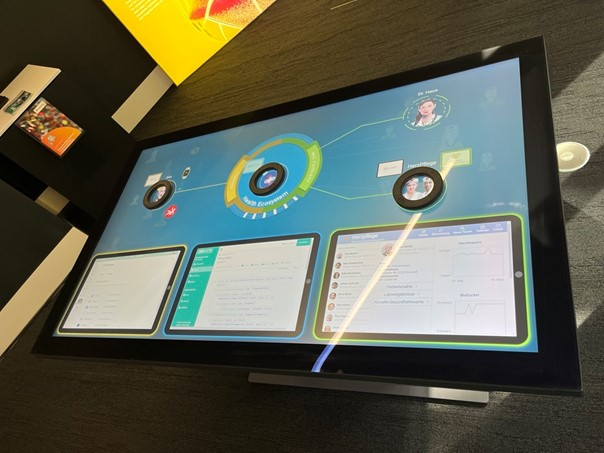

# Smarte.Land.Regionen

<link rel="stylesheet" href="/Daccord/assets/css/slideshow.css">

## Hintergrund

Der Einsatz neuer technischer Möglichkeiten ist entscheidend, um das Lebens- und Arbeitsumfeld, insbesondere in ländlichen Regionen, attraktiv zu gestalten. Dies gilt vor allem für zukunftsrelevante Bereiche wie E-Mobilität, E-Learning, Telemedizin oder die flexible, ortsunabhängige Gestaltung der Arbeit. Auch soziale und kulturelle Angebote auf dem Land können von digitalen Vernetzungs- und Vermarktungsmethoden profitieren.

Unter der Leitung des Fraunhofer IESE werden die digitale Plattform „DEUTSCHLAND.DIGITAL“ sowie dazugehörige Anwendungen entwickelt und erforscht. Im Mittelpunkt steht die Frage: Welche digitalen Software-Lösungen können ländlichen Kreisen helfen, sich zukunftssicher digital aufzustellen?

Der zentrale Dienst der Plattform, den wir in diesem Demonstrator zeigen, ist der Digitale Marktplatz. Über diesen Marktplatz können Landkreise (z. B. Göllheim) digitale Lösungen (z. B. LandRäume, kuubu) für ihre Bürger (z. B. Georg) lizensieren. Anschließend können die Bürger diese Lösungen (in der Regel kostenlos) über den Marktplatz beziehen und nutzen.

Da in den Lösungen verschiedenste Arten von Daten verarbeitet werden können und Vertrauen gerade im kommunalen Kontext ein wichtiger Faktor ist, bieten sich Datenschutz-Cockpits hier gut an, damit Bürgerinnen und Bürger sich lösungsübergreifend über Datenverarbeitungen in diesem Ökosystem informieren können und ihr Selbstbestimmungsrecht wahrnehmen. Um dies zu ermöglichen bietet das Datenschutz-Cockpit auch entsprechende Sichten für die Lösungsanbieter.

Der Demonstrator zeigt im Wesentlichen folgende Abläufe:
- Lösungsanbieter ändert Datenschutzerklärung
- Bürger informiert sich über Änderungen in der neuen Datenschutzerklärung
- Bürger ändert die Berechtigungen einer Lösung
- Bürger nimmt sein Recht auf Datenauskunft wahr
- Lösungsanbieter bearbeitet Datenauskunft
- Bürger lädt seine Daten herunter

Die grundlegenden Abläufe sind mit denen aus dem vorherigen Beispiel, der [digitalen Gesundheitsplattform](<Digitale Gesundheitsplattform>), vergleichbar. Wir empfehlen daher, zuerst das dort gezeigte Demo-Video anzusehen.

## Demonstrator

Die hier gezeigten Screenshots verdeutlichen die Funktionen und Abläufe.

  

    
1 / 11

    
    
&Uuml;bersicht über das Digitale &Ouml;kosystem &copy; Fraunhofer IESE

  

  
  

    
2 / 11

    
    
DEUTSCHLAND.DIGITAL &copy; Fraunhofer IESE

  

   
  

    
3 / 11

    
    
&Uuml;bersicht über die Neuigkeiten - LandR&auml;ume wurde hinzugef&uuml;gt &copy; Fraunhofer IESE

  

   
  

    
4 / 11

    
    
Detailseite zur L&ouml;sung LandR&auml;ume &copy; Fraunhofer IESE

  

   
  

    
5 / 11

    
    
&Uuml;bersicht &uuml;ber die L&ouml;sungen &copy; Fraunhofer IESE

  

   
  

    
6 / 11

    
    
&Uuml;bersicht &uuml;ber die LandR&auml;ume-Nutzer &copy; Fraunhofer IESE

  

   
  

    
7 / 11

    
    
LandR&auml;ume bearbeitet seine Datenschutzerkl&auml;rung &copy; Fraunhofer IESE

  

 
   

    
8 / 11

    
    
Georg pr&uuml;ft die &Auml;nderungen &copy; Fraunhofer IESE

  

  
  

    
9 / 11

    
    
Georg stellt eine Datenanfrage &copy; Fraunhofer IESE

  

  
  

    
10 / 11

    
    
LandR&auml;ume bearbeitet die Datenanfrage &copy; Fraunhofer IESE

  

  

    
11 / 11

    
    
Georg l&auml;dt die Daten herunter &copy; Fraunhofer IESE

  

 
  <a class="prev" onclick="plusSlides(-1)">&#10094;</a>
  <a class="next" onclick="plusSlides(1)">&#10095;</a>

  
  
  
  
  
  
  
  
  
  
  

## Einbettung in den IESE-Demo-Bereich

Das Fraunhofer IESE betreibt einen Demo-Bereich, in dem wissenschaftliche Erkenntnisse und Produkte des Instituts für interessierte Besucher aus Wissenschaft, Wirtschaft und Politik anfassbar demonstriert werden. Dieser Demo-Bereich besteht aus mehreren "Kuben", die sich jeweils einem konkreten Schwerpunktthema widmen, darunter der Kubus "Datensouveränität und Cybersicherheit". In diesem Kubus wird der hier beschriebene Demonstrator auf einem interaktiven Touch-Tisch gezeigt. Die folgenden Fotos vermitteln einen Eindruck des aktuellen Zustandes.

****

| [ Demonstratoren](./) | [Digitale Gesundheitsplattform ](Digitale Gesundheitsplattform) |

****
