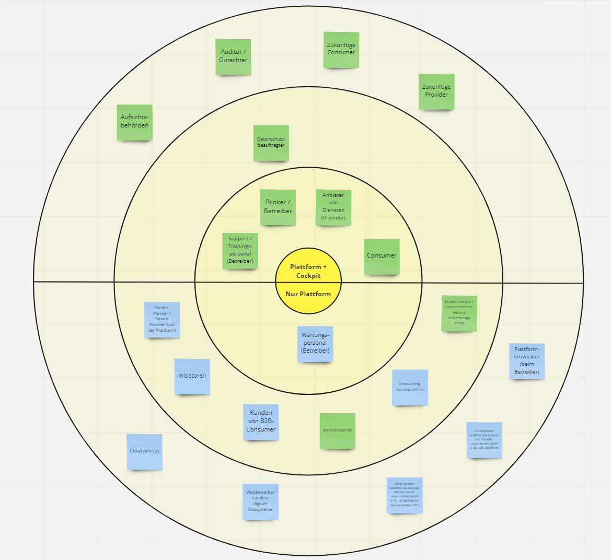

# Befähigungskonzept – Konzept zur Sensibilisierung und Befähigung zum Einsatz des Datenschutz-Cockpits

Das Befähigungskonzept als umfassender und methodisch fundierter Ansatz
zielt im Projekt zum einen auf die Steigerung der Datenkompetenz und
digitalen Souveränität der Nutzerinnen und Nutzer in digitalen
Ökosystemen ab. Zum anderen sollen Nutzer und Nutzerinnen dazu befähigt
werden, ein Datenschutzcockpit effektiv nutzen zu können – unabhängig
von Vorwissen und persönlichen Interessen im Kontext Datenschutz und
Privacy. Durch die sorgfältige Analyse der Stakeholder, die Entwicklung
von Personas, sowie die Durchführung einer Nutzer-Studie konnten die
Bedarfe ermittelt werden, welche in die Entwicklung innovativer
Lehr-Lern-Formate eingeflossen sind.

Zunächst jedoch galt es, im Rahmen der Entwicklung des
Befähigungskonzeptes, sich den Bedarfen der Zielgruppe (Stakeholder des
Datenschutzcockpits) zu nähern.

Die Vorgehensweise wird nachfolgend anhand wesentlicher Teil-Schritte
skizziert

- Analyse der Stakeholder
- Entwicklung von Personas
- Nutzer-Studie
- Lehr-Lern-Formate

## Analyse der Stakeholder

Das Befähigungskonzept fokussiert auf Nutzerinnen und Nutzer von
digitalen Ökosystemen. Dies sind zum einen all jene Nutzerinnen und
Nutzer, die im berufliche Kontext in digitalen Ökosystemen unterwegs
sind, zum anderen aber auch private Endnutzer. Neben diesen zentralen
Rollen, die bei der Entwicklung des Befähigungskonzeptes in den Fokus
gestellt werden, gibt es zahlreiche weitere Stakeholder im Kontext eines
digitalen Ökosystems. Eine Stakeholderanalyse im Umfeld eines digitalen
Ökosystems bezieht sich auf die Identifizierung und Analyse aller
Parteien oder Akteure, die in das Ökosystem eingebunden sind und in
irgendeiner Weise davon betroffen sind oder darauf Einfluss nehmen.

Eine Stakeholderanalyse kann dabei helfen, die Bedürfnisse und
Erwartungen der verschiedenen Akteure und Betroffenen besser zu
verstehen und geeignete Maßnahmen zu ergreifen, um deren Interessen zu
berücksichtigen. Dies kann dazu beitragen, das Vertrauen der Stakeholder
zu gewinnen und langfristige Beziehungen aufzubauen.

Die Stakeholderanalyse wurde in folgenden Teil-Schritten umgesetzt:

1. Identifikation der Stakeholder: Mit Hilfe der im D’accord-Projekt
   entwickelten Matrix wurden die Akteure bzw. Gruppen, die an einem
   digitalen Ökosystem beteiligt sind oder davon betroffen sein können,
   identifiziert und systematisch aufgegliedert.

1. Analyse des Umfelds: Zusätzlich wurde das gesamte Umfeld eines
   digitalen Ökosystems analysiert, um gegebenenfalls weitere Stakeholder
   zu identifizieren, die außerhalb des Ökosystems stehen, aber dennoch
   einen Einfluss ausüben können. Dazu können zum Beispiel
   Regierungsbehörden, Datenschutzbeauftragte, Investoren und andere
   Interessengruppen gehören.

1. Hintergründe und Interessen: In einem weiteren Schritt wurden die
   Interessen, bspw. private, gesellschaftliche, rechtliche, ethnische oder
   soziale Interessen, der verschiedenen Stakeholder betrachtet.

1. Betrachtung der Zusammenhänge: Bei den identifizierten Stakeholdern
   wurde diskutiert, inwiefern sie von der Verarbeitung von
   (personenbezogenen) Daten im digitalen Ökosystem betroffen sind (z.B.
   Verbraucher oder Kunde) bzw. ob sie aktiv diese vornehmen (z.B.
   Dienstanbieter, Datenanalyst) oder indirekt beeinflussen (z.B.
   Datenschutzbeauftragter oder Kapitalgeber). Entsprechend wurden sie nach
   ihrem Zusammenhang mit dem digitalen Ökosystem aufgegliedert.

1. Einstufung der Möglichkeiten zur Einflussnahme: Es wurde betrachtet,
   welche Art von Einfluss jeder Stakeholder ausüben kann. Potenzielle
   Möglichkeiten der Einflussnahme können zum Beispiel finanzieller,
   politischer, rechtlicher oder sozialer Art sein.

 
*Abbildung 1: Zwiebelschalenmodell mit der Verortung der Stakeholder*
</figure>

Basierend auf der Bedeutung der verschiedenen Stakeholdergruppen wurde
zunächst eine Priorisierung vorgenommen, sodass sich die Arbeiten auf
die Stakeholder, an die sich das Befähigungskonzept in erster Linie
richten soll, fokussieren können. Diese Stakeholder sind mit
absteigender Priorität:

- Consumer (Kunde, Teilnehmer im digitalen Ökosystem),

- Provider (Anbieter von Dienstleistungen im digitalen Ökosystem),

- Broker (Betreiber eines digitalen Ökosystems).

## Entwicklung von Personas

Personas haben sich nicht nur als hilfreiche Methode zur Benutzeranalyse
etabliert, indem sie dabei helfen, relevante Nutzertypen griffig zu
charakterisieren und sich in diese hineinzuversetzen, sondern bilden
auch eine wichtige Grundlage für eine differenzierte Auseinandersetzung
mit den Kompetenzen, Fähigkeiten und Erwartungen von unterschiedlichen
Benutzergruppen. Ziel von Personabeschreibungen ist es, Nutzergruppen
konkreter und damit lebensnaher zu beschreiben als dies mit abstrakten
Nutzerklassen (Benutzerklassen) möglich ist. Dazu sind diese möglichst
präzise gefasst und beinhalten unter anderem Ziele, Fertigkeiten,
Kenntnisse, Präferenzen und Verhaltensweisen typischer Nutzergruppen.
Dementsprechend sind in Personabeschreibungen auch Details wie z. B.
Name Geschlecht, Alter, Familienverhältnisse, Sprachkenntnisse,
Ausbildung und Beruf, Fachkenntnisse, sowie Interessen und persönliche
Einstellungen und Verhaltensweisen im Kontext Datenschutz enthalten.[^1]

Die Entwicklung von und Arbeit mit Personas kann dabei helfen, besser zu
verstehen, wie verschiedene Nutzergruppen Informationen aufnehmen und
verstehen (Neues erlernen) und damit wesentlich dazu beitragen,
gebrauchstaugliche Datenschutzfunktionen zu entwickeln, welche effektiv
die digitale Souveränität und Datensouveränität der Nutzerinnen und
Nutzer fördern sowie auch zu einer Steigerung der digitalen Kompetenzen
dieser beitragen.[^2]

Das Konzept der Privacy-Personas sowie die praktische Umsetzung im
Projekt wird in einem separaten (Teil-)Kapitel beschrieben
(HIER QUERVERWEIS EINFÜGEN).

## Interview-Studie mit den zukünftigen Nutzern

Das Hauptziel dieser Studie war es, den aktuellen Status, die
Anforderungen und die Bedürf-nisse der Nutzer genau zu erfassen. Hierzu
wurden Experten-Interviews durchgeführt. Die Ergebnisse der
Experten-Interviews dienten als Grundlage für das Mapping, um zu
bestimmen, welche spezifischen Benutzergruppen von unserem
Befähigungskonzept zentral adressiert werden müssen. Darüber hinaus
ermöglichten sie uns, wertvolle Handlungsempfehlungen für die weitere
Entwicklung abzuleiten.

Um einen bestmögliche Einblick in die Stakeholdergruppe der
Cockpit-Nutzer zu erhalten und deren Fachwissen im Bereich Datenschutz
kennenzulernen, wurde daher eine Studie mit den potenziell zukünftigen
Nutzern des Datenschutz-Cockpits durchgeführt. Als adäquate
Forschungsmethode wurde hierzu das Experten-Interview gewählt, da diese
einen Zugang zu tiefgehendem Fachwissen ermöglichen.

In unserem Betrachtungsfall sind die Experten diejenigen Personen bei
den Anwendungspartnern, die im weiteren Verlauf des Projekts die
entwickelten Demonstratoren des Datenschutz-Cockpits erproben. Die
strukturierten Gespräche mit dieser Zielgruppe dienten dazu, neben den
bestehenden Anforderungen und Bedarfen einen vertieften und qualitativ
hochwertigen Einblick in den Umgang mit personenbezogenen Daten sowie
einen Überblick über die vorhandenen Kompetenzen, Qualifikationen und
persönlichen Einstellungen in Bezug auf Datenschutz zu erhalten.

Diese Vorgehensweise ist besonders hilfreich, wenn es darum geht,
komplexe oder nuancierte Fragen zu behandeln, die ein tieferes
Verständnis erfordern. So konnte ein umfassenderes Verständnis für die
Zielgruppe ausgebildet werden, auf dessen Basis das Befähigungskonzept
mit den innovativen Lehr-Lern-Formaten entwickelt werden konnte.

Insgesamt haben neun Teilnehmende von potenziellen Anwendungs- und
Erprobungspartnern an den Experten-Interviews teilgenommen. Grundlage
der Interviews war ein strukturierter Interviewleitfaden, wobei die
Fragen so formuliert waren, dass sie den Experten einen klaren Rahmen
boten, gleichzeitig aber auch Raum für ausführliche und offene Antworten
ließen.

Jedes Experten-Interview begann mit einem einleitenden Dialog, der den
Hintergrund der Studie erläuterte und ihre Einordnung in das
übergeordnete Forschungsprojekt D’accord skizzierte. Dies diente dazu,
den Teilnehmern einen Überblick über den Kontext der Studie zu geben und
ihre Zusammenarbeit zu fördern. Zusätzlich wurden zentrale Begriffe wie
zum Beispiel "Datenschutz-Cockpit" und "digitales Ökosystem" ausgehend
von unserem D’accord-Glossar ausführlich erläutert, um sicherzustellen,
dass alle Beteiligten ein gemeinsames Verständnis dieser Konzepte
hatten. Alle Interviews wurden dokumentiert und die Aussagen im
Anschluss systematisch ausgewertet. Die Ergebnisse dieser Analyse
bildeten die Grundlage für die Schlussfolgerungen und Empfehlungen, die
aus der Studie abgeleitet wurden.

Nachfolgend werden die wesentlichen Inhalte des Leitfadens sowie die
Antworten der Teilnehmenden sinngemäß zusammengefasst.

###### 1. Relevanz von Sensibilisierungs- bzw. Weiterbildungsangeboten rund um das Thema Datenschutz bzw. Datensouveränität

- Ich finde das sehr relevant, weil man, wenn man sich damit als
  „Otto-Normalverbraucher“ beschäftigt, merkt, wie wenig man darüber
  weiß und wie wenig es kenntlich gemacht wird. Beispielweise besteht
  bei nur wenigen Webseiten die Pflicht durch die AGBs und Erklärungen
  durchzuscrollen. Bei ganz vielen ist es nur, wenn Sie lesen möchten,
  hier ist der Link, ansonsten können Sie einfach zustimmen.

- Halte ich tatsächlich für sehr sinnvoll und tatsächlich würde ich auch
  empfehlen, gerade weil ich das in meinem Umfeld sehe. Da wird
  Datenschutz nicht immer großgeschrieben und das Verständnis fehlt sehr
  oft dafür.

- Halte ich für sehr wichtig. Also das ist mittlerweile ein Thema, das
  nicht mehr wegzudenken ist. Das ist ein sehr umfassendes Gebiet,
  worauf man sich einlassen muss. In unserer Branche wird das Thema
  schnell mit dem Kunden abgehandelt durch eine Unterschrift mit kurzer
  Erläuterung, aber, wenn man ehrlich ist, was da komplett
  dahintersteht, ist in dem Moment niemandem so bewusst.

###### 2. Wichtige Kompetenzen, um in digitalen Ökosystemen bzw. einer digitalisierten Welt souverän, also selbstbestimmt und sicher agieren zu können

- Das Verständnis technischer Seite, dass man damit umgehen kann und wie
  gesagt, auch im Datenschutz sollten wir dann auch wissen warum, wieso,
  weshalb, wo es herkommt und dass man das auch verstanden hat und auch
  so weitergeben kann.

- Ich kann nur dann kompetent handeln, wenn ich auch das entsprechende
  Wissen habe, um meine Handlung auch zu reflektieren. Bestenfalls
  sollte vorab schon klar sein, welche Konsequenzen und Auswirkungen
  mein Handeln haben kann. Insofern brauch ich natürlich einen
  Wissensaufbau und ich muss in der Lage sein dieses Wissen auch
  anzuwenden, das ist die höchste Form der Kompetenz eigentlich.

- Eine Kompetenz, die man als Nutzer haben sollte, ist natürlich erstmal
  zu wissen, was mit den Daten passiert, wie sie verarbeitet oder sogar
  weitergeleitet werden. Sowas hatte ich gerade tatsächlich, insofern
  ist das ein sehr schönes Beispiel.

- Die Leute müssen dahingehend sensibilisiert werden, wie Daten wirklich
  genutzt und weitergereicht werden. Ganz, ganz wichtiges Thema.

###### 3. Besonders beachtenswerte Inhalte oder Themen, um in digitalen Ökosystemen bzw. einer digitalisierten Welt souverän, also selbstbestimmt und sicher, agieren zu können

- Ich denke, wenn Awareness geschaffen wird und wenn man darauf
  aufmerksam gemacht wird, dann ist man da achtsamer.

- Speziell der Umgang mit Finanzdaten sollte behandelt werde. Also ich
  möchte natürlich vermeiden, dass meine Daten und vor allen Dingen wie
  Finanzierungen, also Finanzdaten irgendwo in der Welt rumgetragen
  werden. Es wäre gut zu wissen, wie gerade diese Punkte sicher sind,
  also nicht nur rein von der Variante her.

- Das wäre so für mich die Prioritäten, dass ich sagen kann, ok und ich
  möchte halt selbst entscheiden können, wer meine Daten bekommt und
  jetzt einfach nur der Name die Dritte.

- Welche Konsequenz habe ich mit meinem Handeln und welche Anforderungen
  muss ich jetzt quasi schon an den Datenschutz stellen. Wenn man sich
  erst im Nachhinein damit befasst, ist es einfach zu spät. Vorher habe
  ich noch nie drüber nachgedacht, was mit meiner Unterschrift wegen
  Datenschutz wirklich passiert. Darüber habe ich mir nicht wirklich
  Gedanken gemacht und einfach vertraut.

###### 4. Persönliche Auseinandersetzung mit den Themen Datenschutz bzw. Datensouveränität, um das eigene Wissen/ die eigenen Kompetenzen diesbezüglich zu steigern sowie Beobachtungen/ Erfahrungen, wie andere damit umgehen

- Also im ersten Moment googeln. Da gibt es verschiedene Beschlüsse, die
  deutschlandweit gelten und man kommt dann auch relativ schnell schon
  auf die Artikel.

- Ja, da wird der Freund Google mal gefragt. Ich glaube, das ist für
  jemanden, der nicht professionell ist, ein Versuch das bestmöglich zu
  machen, ohne die Sicherheit zu haben, dass das, was man macht, richtig
  und ausreichend ist.

- Google ist mein bester Freund und das zweite sind hauptsächlich
  Gesetze. Also ich lese tatsächlich erst normalerweise Gesetze, bevor
  ich mir 5 Blogs und 5 Auslegungen dazu anschaue.

- Die meisten Leute lesen einen Blog-Eintrag, was irgendjemand aus dem
  Gesetz heraus interpretiert. Bestenfalls sind dies Beiträge oder
  Webseiten von Anwälten.

###### 5. Spezifische Anforderungen an Sensibilisierungs- bzw. Weiterbildungsangebote? Differenzierte Betrachtung ggf. spezieller Formate (z.B. Online- oder Präsenzschulung, externe Schulung, formelle Lerneinheiten, Lernbausteine im Arbeitsalltag, informeller Wissensaustausch, Regelmäßigkeit der Sensibilisierungs- und Weiterbildungsangebote)

- Leitfäden

- Webseite von einem Ministerium mit Reiter der über die AGBs und die
  Cookies informieren, mit Informationen über Rechtliches und
  Datenschutz. Auch so Formate einbauen wie beispielsweise erklärende
  Videos, ein Einleitungstext, Begrüßungsvideo etc.

- Von offizieller Stelle, bspw. Ministerien und Bundesbehörde
  veröffentlicht, weil man dann das Gefühl der Sicherheit hat.

- Ich denke, moderne Methoden, also halt Videos oder auch interaktive
  Lerntools.

- Bevor ich den informellen Austausch bspw. mit Kollegen suche, schaue
  ich doch sicherheitshalber auf offizielle Webseiten, Artikel etc. Das
  gibt mehr Sicherheit als ein Halbwissen von Kollegen.

- Aus dem Stegreif würde ich jetzt mal behaupten, Video-Sequenzen, da
  das Gesehene, das ist ja etwas, was der Mensch immer sehr gern
  aufnimmt. Das selbst geschriebene Wort eigentlich auch, also man
  müsste dann quasi selber schon irgendwie Notizen machen können.

- Eine Checkliste nicht nur mit einem Kreuzchen oder so. Aber ein Video
  als Variante finde ich gut, das ist ja heute mittlerweile auch über
  Internet usw.

- Das Thema Datenschutz muss regelmäßig in den Mittelpunkt gestellt
  werden. Man sieht es im beruflichen Kontext sehr gut. Da bekommt man
  eine Datenschutzschulung zu Beginn, aber nach 5 Jahren weiß man schon
  nicht mehr, was da genau drinstand. Man macht die auch nur, weil es
  Pflicht ist. Besser wären regelmäßige kleine Hinweise, um das
  Bewusstsein dafür zu schärfen.

###### 6. Persönlich bevorzugte Formate und Inhalte

- Leitfäden

- Websites mit kurzen Videos

- Videos find ich halt nie verkehrt. Da muss man nichts lesen.

- Eher visuell - ein Video oder so was

- Keine Masse an Papierdokumentation, lieber elektronische Dokumente,
  die man durchsuchen kann und wo die Informationen zusammengefasst
  drinstehen.

- Eine A4-Seite mit den wichtigsten Bullet-Points, keine 10-seitige
  Powerpoint-Präsentationen.

###### 7. Bisherige Auseinandersetzung mit dem Thema Datensouveränität im Allgemeinen sowie Sensibilisierungs- bzw. Weiterbildungsangeboten im Speziellen

- Geändert hat sich beispielsweise, dass ich App-Tracking ablehne, was
  ja auch eine neue Funktion ist. Wusste ich vorher nicht und habe es
  eher durch Zufall gelesen, dass es das gibt.

- Es gibt mittlerweile Situationen, wo ich sage, ich lehne die Cookies
  ab, denn das geht ja auch so, wenn ich auf einer Webseite nur etwas
  lesen will. Also das kann man auch individualisieren, aber das ist
  sehr selten und schwierig zu verstehen. Es müsste da eine einheitliche
  Symbolik geben. Diese Symbolik würde einen eher stoppen, denn ein
  Cookie Banner ist extra so unattraktiv gestaltet, dass man einfach nur
  aus seinem Sichtfeld haben will, wenn man eine Webseite anschaut.

- Ich tu das auf jeden Fall. Mir ist bewusst, dass meine Daten definitiv
  abgegriffen werden. Versuche das ein wenig zu minimieren. Also ich bin
  generell jemand, der auf Webseiten Cookies ablehnt, ich bin definitiv
  jemand, der auf dem Handy nicht „Ich unterstütze alle
  Datenübertragung“ angibt, sondern tu das auch eher so ein bisschen
  einschränken. Dennoch ist mir bewusst, dass sie trotzdem noch mehr
  abgreifen als mir lieb ist.

- Ich bin durch ein Ereignis im Nachhinein vorausschauender geworden.
  Habe mir Gedanken dazu gemacht, was eigentlich Einfluss hat, und habe
  auch gesehen, nachdem ich das dann sehr bewusst gemacht hab ein
  bisschen, was ich im Internet mitkriege, und sehe, wie es läuft.

- Gibt es tatsächlich. Also ich sag mal, vorher habe ich, wenn jetzt mal
  irgendeine Spam-Mail kam, einfach ignoriert und gelöscht. Dann hat man
  Ruhe im Moment, aber es werden immer mehr. In dem Moment denkt man
  auch selbst, keine Ahnung wo jede Woche die ganzen Newsletter oder
  Spam-Mails herkommen und wo habe ich meine Adresse angegeben.

###### 8. Einflussfaktoren, die dazu führen, die eigene Datensouveränität zwar ggf. zu überdenken, letztlich aber alles beim Alten zu belassen (Verhaltensänderung verhindern)

- Ich habe mir mal vorgenommen, die Datenschutzerklärungen, AGBs zu
  lesen, bevor ich den haken setz. Aber ehrlich gesagt, das versteht
  doch kein Mensch und man braucht locker 45 Minuten, um den ganzen Text
  zu lesen. Danach weiß man aber nicht mehr wie vorher und setzt doch
  den Haken, weil man es muss. Dann spart man sich doch wieder die Zeit
  alles zu lesen.

- Auf Plattformen muss man die Einstellungen erstmal suchen. Wenn man
  einfach nur den Dienst nutzen will, macht man das nicht, sondern surft
  drauf los. Wenn man dann an einen Punkt kommt, wo man eine Frage hat
  oder wo etwas auffällt, muss man erst suchen, wo man die Einstellungen
  und die Informationen dazu finden kann.

Die Ergebnisse der Erhebung zeichnen ein relativ einheitliches Bild.
Nahezu alle Befragten sehen sich selbst eher als Amateure oder Laien im
Bereich des Datenschutzes. Es wurde deutlich, dass nur begrenztes
Fachwissen vorhanden ist und ein nur geringes Verständnis für die
komplexen Zusammenhänge und die möglichen Konsequenzen ihres Handelns
besteht.

Für die Entwicklung des Befähigungskonzepts und insbesondere dessen
praktischer Umsetzung mit innovativen Lehr-Lern-Formaten waren einige
Ergebnisse besonders relevant:

- Grundsätzlich wurde deutlich, dass die Sensibilisierung der
  Cockpit-Nutzer, aber auch der Ökosystem-Nutzer allgemein, in den Fokus
  gerückt werden muss. Eine Awareness für das Thema Datenschutz entsteht
  fast immer nur als Konsequenz eines negativen Ereignisses (bspw. Spam-
  oder Scam-Mails/ -Anrufe, Weitergabe von Daten bis hin zu
  Datenmissbrauch).

- Eine einmalige große Veranstaltung, Präsentation oder eine Publikation
  erscheint nicht zielführend. Besser erscheinen viele kleine Bausteine,
  die regelmäßig bei der Nutzung der Plattform bzw. des digitalen
  Ökosystems eingestreut werden können, um für das Thema Datenschutz
  fortwährend zu sensibilisieren.

- Lern-/ Wissensbausteine müssen thematisch eng zugeschnitten sein,
  damit nicht zu viel Wissen auf einmal vermittelt wird und
  zielgerichteter danach gesucht werden kann. Nutzer haben individuelle
  Wissensbedürfnisse und Vorerfahrungen, sodass es verschiedene
  Themenschwerpunkte geben muss, um passendes Wissen bereitzustellen.
  Bspw. rechtliche Hintergründe, technische Hintergründe, Konsequenzen
  des Handelns, Schutzmöglichkeiten etc.

- Der Umfang bzw. die Länge der Lern-/ Wissensbausteine müssen begrenzt
  sein, sodass sie „auf die Schnelle“ in den entsprechenden Situationen
  direkt gesucht und überschaut werden können. Suchen und Lesen langer
  Texte wirkt in den Situationen unattraktiv.

- Bereitstellung bzw. Verlinkung der Lern- und Wissensbausteine an
  relevanten Orten im digitalen Ökosystem, um die Relevanz des Themas
  sichtbar zu machen und einen leichten Zugang zu den Bausteinen zu
  ermöglichen.

- Als Format wird von den Befragten einheitlich ein Video präferiert, da
  es zeitgemäß und leicht zugänglich ist.

- Eine einfache, für juristische Laien leicht verständliche Sprache bzw.
  die Übersetzung der oft juristischen Sprache in ein verständliches
  Format ist ein zentrales Element. Auch Begriffserläuterungen können
  helfen, Texte besser verständlich zu machen.

- Das formelle Erscheinungsbild ist wichtig, um die
  Glaubhaftigkeit/Seriosität als Wissensquelle zu belegen. Verweise auf
  Gesetze und rechtliche Regelungen unterstützen dies, dürfen aber nicht
  im Fokus stehen. Auch eine Einbettung auf offiziellen Seiten/
  Plattformen, die Seriosität versinnbildlichen, ist anzustreben.

- Ziel muss sein, den Menschen zu befähigen, die Auswirkungen seines
  Handelns zu verstehen und es reflektieren zu können.

Ein interessanter Aspekt, der während der Interviews zutage trat, war,
dass negative Ereignisse häufig als Auslöser für eine intensivere
Auseinandersetzung mit dem Thema Datenschutz fungieren. Dies
verdeutlicht, dass Awareness und Bildung in diesem Bereich besonders
durch praxisnahe Erlebnisse und Erfahrungen beeinflusst werden.
Insgesamt ergibt sich aus diesen ersten Ergebnissen ein schlüssiges
Bild, auf dessen Basis der Fokus bei der Entwicklung eines
Befähigungskonzeptes eher auf die Personas gelegt werden kann, die einen
unbedachten Umgang mit personenbezogenen Daten praktizieren und über
wenig Fachwissen verfügen. Dennoch wurden in den folgenden
Entwicklungsschritten auch die erfahrenen Nutzergruppen nicht
vernachlässigt, sondern die Lehr-Lern-Formate derart konzipiert, dass
die Inhalte je nach Vorwissen individuell angeschaut werden können. So
sind die verschiedenen thematischen Bausteine des Lehr-Lern-Formats
beispielsweise in Einführungs- und Vertiefungsmodule aufgebaut. Oder
Inhalte, die für Anfänger zum Wissensaufbau dienen, können von
Fortgeschrittenen als Nachschlagewerk verwendet werden.

## Lehr-Lern-Formate

Konzept und Inhalt dieser innovativen Lehr-Lern-Formate, welche das
wesentliche Element des Befähigungskonzeptes in diesem Projekt bilden,
werden in einem separaten Teil-Kapitel vorgestellt
(HIER QUERVERWEIS EINFÜGEN). Dabei zielen die
Lehr-Lern-Formate darauf ab, die Nutzerinnen und Nutzer nicht nur im
Umgang mit Datenschutzcockpits zu schulen, sondern auch ihre allgemeine
Datenkompetenz zu fördern und ihre digitale Selbstbestimmung zu stärken.

## Zusammenfassung

Basierend auf der oben beschriebenen Vorgehensweise teilen sich konkrete
Vorgehen zur Umsetzung des Befähigungskonzeptes in zwei Maßnahmen auf,
die sicherstellen, dass das Befähigungskonzept insgesamt einen
relevanten Beitrag zur erfolgreichen Integration von Datenschutzcockpits
in digitale Ökosysteme leisten kann. Zum einen wurde ein Online-Kurs zu
Datenschutzthemen auf der Lern-und Aktionsplattform (LEA) entwickelt,
der darauf abzielt, Unternehmen als auch Nutzerinnen und Nutzer im
privaten Umfeld gegenüber dem Bewusstsein für Datenschutzthemen,
digitale Souveränität und den Wert von Daten zu sensibilisieren. Zum
anderen wurden kurze Informationsvideos (Tutorials) für die einzelnen
Funktionen des Datenschutzcockpits erstellt, die an den entsprechenden
Stellen in dem Cockpit eingebunden werden. Bei Bedarf können diese
schnell und einfach abgerufen und die Nutzerinnen und Nutzer so befähigt
werden, das Cockpit zu verwenden, auch wenn sich ihnen eine Funktion
nicht unmittelbar erschließt.

[^1]:
    Vgl. Dehling, F., Ludborzs, S., Weßner, A. et al. Konzepte für
    gebrauchstaugliche Datenschutzfunktionen in digitalen Ökosystemen.
    Datenschutz Datensich 48, 95–102 (2024).

[^2]:
    Vgl. Dehling, F., Ludborzs, S., Weßner, A. et al. Konzepte für
    gebrauchstaugliche Datenschutzfunktionen in digitalen Ökosystemen.
    Datenschutz Datensich 48, 95–102 (2024).

****

| [ Einführungskonzept](<Einführungskonzept>) | [Lehr- und Lernformate ](<Lehr- und Lernformate>) |

****