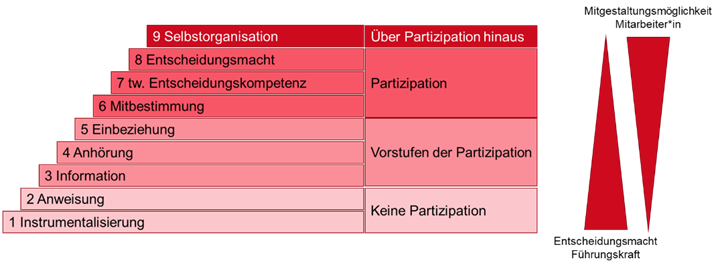
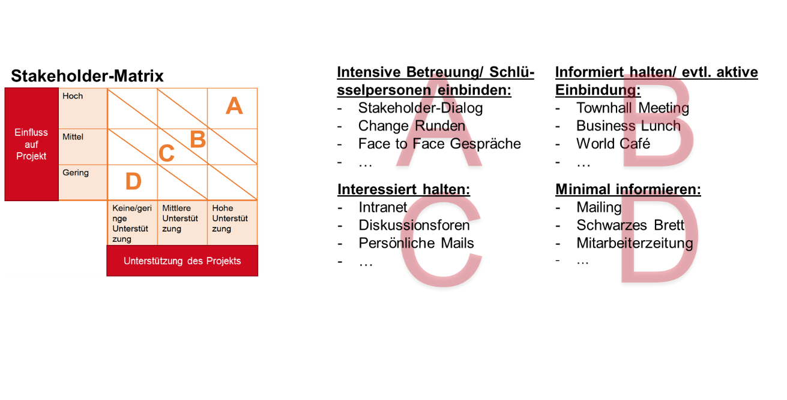
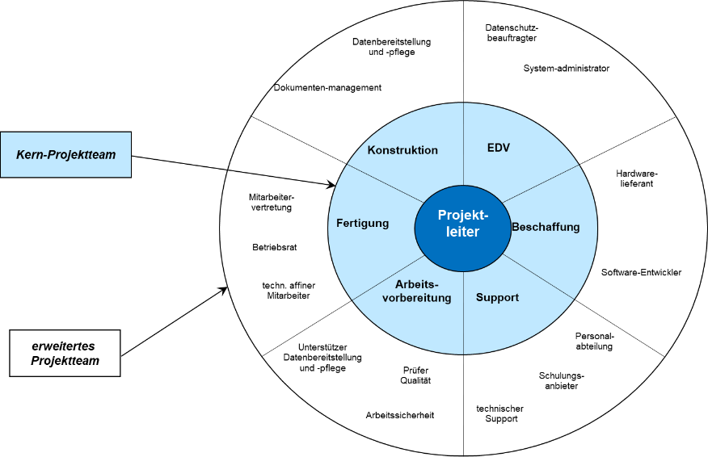

# Konzepte zur Einführung von Datenschutz-Cockpits

## Einleitung

Neue Technologien und digitale Lösungen können die Prozesse in Unternehmen und Organisationen an vielen Stellen unterstützen und Abläufe optimieren. Gleichzeitig bergen sie jedoch auch diverse Risiken in sich. Digitalisierung im Unternehmen bedeutet nicht nur die Einführung einer neuen Technologie, digitalen Lösung oder Software, sondern ist als ein tiefgreifender Veränderungsprozess zu verstehen. Diese Erkenntnis findet ihre Fundierung im sozio-technologischen Systemansatz nach Ulich, wonach bei der Einführung digitaler Lösungen auf der technischen Seite auch die Organisation mit ihren Strukturen und Vereinbarungen sowie das soziale Gefüge im Unternehmen rund um den Menschen als Mitarbeitenden beeinflussen kann.[\[1\]](#footnote-1) Das komplexe Zusammenwirken von technischen, organisationalen und sozialen Systemen wird demnach oftmals nicht ausreichend beachtet, wodurch es zu Schwierigkeiten bei der Umsetzung kommt: die ausgewählte Technologie entspricht nicht den Anforderungen am Arbeitsplatz, Mitarbeitende wurden nicht rechtzeitig geschult und sind überfordert oder der Betriebsrat bzw. die Personalvertretung sieht die Mitarbeitenden unzulässig überwacht und blockiert den Einsatz der neuen Technologie.[\[2\]](#footnote-2)

Zusätzlich schüren Veränderung und Wandel in der Regel Emotionen bei den Betroffenen, die den nachhaltigen Erfolg der neuen Technologie im Unternehmen beeinflussen können. Häufig sind diese Emotionen vorwiegend negativ. Mitarbeitende werden in ihrer als sicher und stabil empfundenen Komfortzone durch Veränderungen mit Unsicherheit und Kontrollverlust konfrontiert. Dies kann zunächst Irritationen und Sorge auslösen und sich schnell hin zu Angst, Frustration und sogar Widerständen gegenüber der Veränderung entwickeln. Grund dafür sind bspw. die Angst vor dem Verlust des Arbeitsplatzes, vor Veränderungen in Bezug auf die Kompetenzanforderungen oder Bedenken bzgl. der Verarbeitung personenbezogener Daten. Damit sich die Widerstände nicht verfestigen bzw. es im Idealfall erst gar nicht zu Widerständen kommt, müssen die Sorgen und Ängste der Mittarbeitenden angemessen adressiert werden, z.B. durch Methoden des Change-Managements. Wichtige Faktoren dabei sind die Kommunikation mit den Mitarbeitenden über die Veränderung, die Einbeziehung und Möglichkeit der Mitgestaltung der Veränderungen durch die Mitarbeitenden und Weiterbildung der Mitarbeitenden entsprechend der sich wandelnden Kompetenzen.[\[3\]](#footnote-3) Effektive Change-Management Strategien sind entscheidend, um den Übergang zu neuen Technologien zu erleichtern.

Das im Projekt D’accord entwickelte Datenschutz-Cockpit ist eine zentrale Anlaufstelle um in digitalen Ökosystemen die Rechte der Betroffenen entsprechend der DSGVO wahrnehmen zu können, die Nutzenden dieser Systeme zustehen. Ein Datenschutz-Cockpit stellt eine Benutzeroberfläche dar, die es ermöglicht, sowohl vorhandene Einwilligungen einzusehen als auch die Kontrolle über die Verarbeitung personenbezogener Daten zu übernehmen. Das Cockpit erlaubt den Nutzenden, spezifische Einstellungen darüber vorzunehmen, welche Daten für welche Zwecke verarbeitet werden dürfen. Bspw. ermöglicht dies granulare Einstellungen bezüglich der Verwendung von Daten zu Marketingzwecken oder Kommunikationspräferenzen. Im Gegensatz zu Datenschutz-Dashboards, die primär Transparenzfunktionen bieten, umfasst das Datenschutz-Cockpit somit erweiterte Steuerungs- und Einstellungsmöglichkeiten für die Nutzenden. Das Cockpit wird auf Unternehmensseite implementiert und ermöglicht dadurch Datenschutz vollständig, effektiv und nutzerzentriert umzusetzen. Um dieses Potenzial auf Unternehmensseite und somit für die Nutzenden vollständig auszuschöpfen, ist es erforderlich, die Veränderungen in einem strukturierten Change-Management-Prozess aktiv zu gestalten.[\[4\]](#footnote-4)

Als wichtigste Erfolgskriterien bei der Einführung des DSC wurden im Rahmen einer Unternehmensbefragung die Kommunikation mit, die Einbeziehung und die Schulung der Mitarbeitenden genannt. Die befragten Unternehmensvertreter waren sich einig, dass die Technologieeinführung ohne überzeugte Beschäftigte (Technologieakzeptanz) scheitern und das neue Tool sehr wahrscheinlich nicht genutzt wird. Erst wenn man den Wert und Nutzen des DSC effektiv kommuniziert, das Tool einfach und intuitiv entsprechend der Bedürfnisse der Mitarbeitenden nutzbar ist und die Nutzenden schult (Schulungs- und Weiterbildungsprogramme), kann die Veränderung erfolgreich sein.[\[5\]](#footnote-5) Vorteilhaft ist es, den Veränderungsprozess proaktiv und strategisch zu gestalten, anstatt reaktiv auf auftretende Probleme, Verunsicherung und Ablehnung zu reagieren.[\[6\]](#footnote-6) Sogenannte Change-Management-Prozesse sind vielen Unternehmen nicht unbekannt, werden sie doch seit Jahren bereits in verschiedenen Ausgangssituationen eingesetzt, bspw. bei Neuausrichtung eines bestehenden Unternehmens oder bei organisationalen Zusammenschlüssen mehrerer Unternehmenseinheiten. Die Herausforderungen im Kontext einer Einführung neuer Technologien und das Voranschreiten der digitalen Transformation von Unternehmen allgemein wird zukünftig vermehrt der Auslöser für Veränderungsprozesse sein. [\[7\]](#footnote-7)

 ## Herausforderung: Technologieeinführung und digitale Transformation 

Neue Technologien und digitale Lösungen bieten die Chance, die Prozesse und Arbeitsabläufe in Unternehmen und Organisationen zu optimieren und effizienter zu gestalten. Allerdings bedeutet die Einführung einer neuen digitalen Lösung auch einen tiefgreifenden Veränderungsprozess auf der Ebene der Organisation und Mitarbeitenden.

Damit eine solche Veränderung erfolgreich sein kann, ist es nicht ausreichend nur den technischen Aspekt der digitalen Lösung zu betrachten. Vielmehr muss das komplexe Zusammenspiel der technischen, organisationalen und sozialen Faktoren in den Fokus rücken. Eine Vernachlässigung der organisationalen und sozialen Faktoren kann zu weitreichenden Schwierigkeiten führen, die das Scheitern der Einführung der neuen digitalen Lösung zur Folge haben können.

Zusammenfassend gibt es fünf zentrale Gründe, warum die Einführung einer neuen Technologie scheitern kann:

* _Fehlende Kommunikationsstrategie:_  
Viele Unternehmen und Organisationen verzichten auf das Change-Management. Anstatt die digitale Transformation unternehmensweit frühzeitig zu kommunizieren, wird über die Köpfe der Mitarbeitenden hinweg entschieden. Mangelnde Akzeptanz und eine ablehnende Haltung sind hier das Resultat und können zum Scheitern des gesamten Vorhabens führen.

* _Fehlende Partizipation:_  
Die Einführung neuer Technologien erfolgt oftmals ohne Einbindung der Betroffenen bzw. häufig nicht in Zusammenarbeit mit den Mitarbeitenden. Dies hat zur Folge, dass zentrale Anforderungen an die Technologie nicht beachtet werden, Prozesse erst im Nachgang aufwendig optimiert und Arbeitsabläufe umgestaltet oder sogar neu aufgesetzt werden müssen. Auch hier sind Auswirkungen auf die Akzeptanz zu erwarten.

* _Fehlende Schulungen:_  
Oftmals werden neue Technologien und Anwendungen eingeführt, ohne die Mitarbeitenden im Vorfeld für den Einsatz der neuen Technologie zu qualifizieren. Obwohl neue Anwendungen meist mit einer Vielzahl an neuen Funktionen und Anwendungsmöglichkeiten einhergehen, wissen viele Mitarbeitenden durch eine mangelhafte Vorbereitung nicht, wie diese auch effizient genutzt werden können. Die eigentlichen Vorteile der neuen digitalen Lösung bleiben so verborgen.

* _Fehlende Kompatibilität:_  
In der Praxis wird bei der Anschaffung und Einführung neuer digitaler Lösungen der Aspekt der Kompatibilität mit bestehenden Systemen oftmals nicht beachtet. Daraus resultiert, dass Daten manuell übertragen oder in verschiedenen Systemen oder Datenbanken abgeglichen werden müssen – ein Mehraufwand, der viele Ressourcen kostet und den Mehrwert der neuen digitalen Lösung schmälert.

* _Medienbrüche:_  
Auch wenn die Digitalisierung in der alltäglichen Arbeit Vorteile mit sich bringt, müssen bestimmte Dokumente weiterhin physisch angelegt, archiviert und gepflegt werden. Zum Teil wird dies durch das deutsche Recht so verlangt, bspw. in der Buchhaltung und bei Rechnungsbelegen, teilweise werden bestehende Papierarchive ohne zu hinterfragen fortgeführt oder als physische Sicherheitskopie betrachtet. Aber auch weitere Medienbrüche in digitalen Prozessen, wie zum Beispiel das Unterschreiben von Dokumenten, führen am Ende dazu, dass durch den Mehraufwand für die Mitarbeitenden das volle Potenzial einer digitalen Lösung nicht ausgeschöpft werden kann.

Darüber hinaus lassen sich noch weitere, häufig auftretende Herausforderungen bei der Umsetzung und Durchführung von Digitalisierungsvorhaben identifizieren. Unter anderem resultieren diese aus unternehmensspezifischen Gegebenheiten wie zum Beispiel einer Unternehmenskultur, die gegenüber Veränderungen nicht offen ist. Aber auch unklare Verantwortlichkeiten, ein unstrukturiertes Vorgehen sowie ein fehlendes Commitment der Unternehmensleitung und/ oder der Führungskräfte können ein Digitalisierungsprojekt bzw. eine konkrete Einführung einer Technologie negativ beeinträchtigen. Eine abschließende Aufzählung ist nahezu unmöglich und zeigt, wie relevant eine systematisch geplante Vorbereitung und Begleitung einer Technologieeinführung und dem damit einhergehenden Change-Prozess ist.

## Der Mensch als kritischer Erfolgsfaktor einer Technologieeinführung

Betrachtet man die Prozesse in Unternehmen und Organisationen, die im Rahmen der digitalen Transformation verändert und bestenfalls optimiert werden, so wird ersichtlich, dass der Mensch eine zentrale Rolle einnimmt, mithin ein erfolgskritischer Faktor ist. Mitarbeitende, die gut vorbereitet und an den richtigen Stellen in den Prozess eingebunden sind, können eine tragende Rolle bei der Technologieeinführung einnehmen – sei es als Multiplikator\*in oder auch Promoter\*in im eigenen Unternehmen.

Ausreichende Information, Qualifikation und Einbindung sind als fester Bestandteil von Digitalisierungsvorhaben unumgänglich. Geschieht dies nicht oder nicht in einem ausreichenden Maß, so können mangelnde Akzeptanz und Ablehnung auf Seiten der Mitarbeitende entstehen und den digitalen Transformationsprozess hemmen oder gar gänzlich blockieren.

Entsprechend ist es wichtig, die Mitarbeitenden, die täglich in den zu digitalisierenden Prozessen tätig sind, in die digitale Transformation einzubinden und sie mitzunehmen. Schließlich kennen sie die Prozesse am besten und verfügen über wertvolles implizites Wissen, das es bei der Umsetzung der digitalen Lösung zu integrieren gilt.

Eine einfache, strukturierte Vorgehensweise, mit welchen Aktivitäten eine Veränderung strukturiert und partizipativ in acht Schritten angegangen werden kann, bietet u.a. Kotter[\[8\]](#footnote-8):

1. Ein Gefühl der Dringlichkeit erzeugen
2. Führungskoalition aufbauen
3. Vision und Strategie entwickeln
4. Vision des Wandels kommunizieren
5. Befähigung der Mitarbeitende durch ein breit angelegtes Maßnahmenpaket
6. Kurzfristige Erfolge planen und realisieren
7. Erfolge konsolidieren und weitere Veränderungen einleiten
8. Veränderungsbereitschaft in der Unternehmenskultur verankern

Bereits im Rahmen des Projektes TrUSD (Transparente und selbstbestimmte Ausgestaltung der Datennutzung im Unternehmen), bei dem die Erhöhung der Transparenz bei der Erhebung, Verarbeitung und Nutzung personenbezogener Daten im Unternehmenskontext im Mittelpunkt stand, hat das Institut für Technologie und Arbeit (ITA) ein Konzept zur Technologieeinführung von Datenschutzcockpits entwickelt. Das so entstandene partizipative Vorgehensmodell wird nachfolgend als Grundlage herangezogen und auf die Einführung von Datenschutz-Cockpits in digitalen Ökosystemen übertragen.

Dazu wird zunächst das partizipative methodische Vorgehen in seinen Grundzügen erläutert, welches die Grundlage für das ursprüngliche Einführungskonzept bildete und sodann zum Einführungskonzept für Datenschutz-Cockpits in digitalen Ökosystemen erweitert wurde.

## Methodisches Vorgehen

In einem ersten Schritt ist die Durchführung einer strukturierten Beobachtung bei Unternehmen, die das Datenschutz-Cockpit einführen wollen, sinnvoll. Dies hilft dabei, die Unternehmenskultur, Mitarbeitende sowie Arbeitsbedingungen und -umfeld kennenzulernen und die informative Basis für die Einführung des Datenschutz-Cockpits zu schaffen. Im Folgenden wird eine prototypische Vorgehensweise beschrieben, bei der mit Hilfe von Leitfragen Beobachtungen in Unternehmen umgesetzt werden können.

Der Ansatz der strukturierten Beobachtung kommt aus der qualitativen Sozialforschung. Die Umsetzung erfolgt direkt und unvermittelt. Der Standpunkt des Beobachters ist hierbei generell als offen und (an den Arbeitssituationen) nicht-teilnehmend anzusehen. Durch vertiefende Fragen an die Mitarbeitende in den zu beobachtenden Situationen werden ergänzende Informationen und Erkenntnisse erhoben, was jedoch als Eingriff in die Situation gewertet werden könnte. Etwaige Einflüsse aus dieser Interaktion bzw. aus der Situation der offenen Beobachtung heraus werden bei der Dokumentation der Erkenntnisse berücksichtigt.

Als Grundlage für die praktische Umsetzung der strukturierten Beobachtung im Unternehmen wurde folgender Leitfaden entwickelt, der die zentralen Aspekte für die spätere Entwicklung von Konzepten zur Einführung von Datenschutz-Cockpits bei den Anwendungspartnern zusammenfasst:

### Arbeitsatmosphäre

* Ist der Umgang der Mitarbeitenden untereinander förmlich korrekt oder eher ungezwungen und locker?
* Ist man angehalten sich ruhig zu verhalten und sich nur auf Arbeitsthemen zu beschränken oder darf ein offener Austausch auch mal zu privaten Themen stattfinden?
* Verbringen Mitarbeitende ihre Pausen zusammen, bspw. beim gemeinsamen Mittagessen, oder bleibt jeder für sich?
* Gibt es gemeinsame Rituale, Gewohnheiten, Routinen?
* Unterstützen sich die Mitarbeiter gegenseitig bei Problemen und Herausforderungen?
* Werden Probleme und Herausforderungen gemeinsam diskutiert?

### Arbeitsumgebung

* Verfügt jeder Mitarbeitende über einen festen Arbeitsplatz mit PC-Zugang oder flexible Arbeitsmodelle (Desk-Sharing etc.)?
* Sind die Arbeitsplätze mit Notebooks oder ähnlichen mobilen Endgeräten ausgestattet?
* Gibt es Einzel-, Team- oder Großraumbüros?
* Arbeitet man für sich hinter verschlossenen Türen?
* Gibt es Platz für eine kollaborative Zusammenarbeit (Besprechungszonen, Co-Working-Bereiche, Kreativbereiche etc.)?
* Gibt es eine Kaffeeküche, die zum informellen Austausch einlädt und als „Treffpunkt“ dient?
* Legt der Arbeitgeber Wert auf eine adäquate Ausstattung und Gestaltung der Arbeitsumgebung, oder herrscht ein strikter Sparkurs?

###  Organisationsform

- Gibt es ausgeprägte Hierarchien bzw. Organisationsstrukturen, die eingehalten werden müssen (Abteilungssilos etc.)?
- Existieren viele Führungsebenen oder ist die Hierarchie eher flach organisiert?
- Gibt es strikte Regeln und Anordnungen die ohne Hinterfragen befolgt werden oder dienen Prinzipien und Regeln eher als Orientierung für das eigene Handeln?
- Werden (interdisziplinäre) Team/ Kollaborationsansätze verfolgt?
- Gibt es ggf. fixe oder agile Teams bzw. wechseln die Kollegen, mit denen direkt zusammengearbeitet wird, häufiger?

### Offenheit für Innovation, Veränderungsbereitschaft, Fehlerkultur

* Sind die Mitarbeitenden gegenüber Neuerungen offen oder nutzen lieber Altbewährtes?
* Herrscht eine offene Fehlerkultur bzw. werden Fehler zum Lernen genutzt oder werden Fehler strikt geahndet und Verantwortliche gesucht?
* Stehen die Mitarbeitenden Neuerungen und Innovationen eher offen gegenüber oder werden diese kritisch betrachtet?
* Sehen die Mitarbeitenden einen Mehrwert in Neuerungen bzw. Innovationen oder nur einen Mehraufwand?
* Werden Hinweise zur Weiterentwicklung, Verbesserung, besseren Einbettung in die Arbeitsabläufe und Prozesse gegeben?

### Kommunikation

* Muss bei der Kommunikation die Hierarchie/Organisationsstruktur strikt eingehalten werden, oder darf bereichsübergreifend direkt kommuniziert werden?
* Sucht man das persönliche Gespräch oder wird formal über Mails, Messenger etc. kommuniziert?
* Ist die Kommunikation (insbesondere der Führungskräfte) eher im „Präsentiermodus“, oder werden offene Dialoge angeregt?
* Wird die persönliche Du-Form genutzt oder eher die formelle Sie-Form?
* Ist die Kommunikation intern eher locker und leger oder wird besonnen nur über spezifische Aspekte gesprochen und der Informationsfluss kontrolliert bzw. begrenzt?
* Bleibt neben der täglichen Arbeit ausreichend Zeit für Kommunikation, bspw. in Regelmeetings?
* Werden Konflikte und Probleme offen angesprochen oder werden diese bewusst zurückgehalten?

Die strukturierte Beobachtung liefert wichtige Erkenntnisse zur aktuellen Ist-Situation des Unternehmens. Die auf diese Weise gewonnenen Daten und Informationen sind ein wesentlicher Beitrag zur erfolgreichen Einführung des Datenschutz-Cockpits, da diese als Grundlage für die Ableitung weiterer strategischer Maßnahmen dienen.

## Prozess zur Einführung des Datenschutz-Cockpits

Wie die vorangegangenen grundsätzlichen Ausführungen verdeutlichen, erfordert die Einführung einer neuen Technologie einen strukturierten und planvollen Ansatz, der auch strategische Aspekte berücksichtigt.

Zur Erweiterung des Einführungskonzeptes des Datenschutz-Cockpits orientieren wir uns an den vier Phasen des digitalen Transformationsprozesses[\[9\]](#footnote-9). Ziel dieses Prozesses ist die erfolgreiche Implementierung neuer Technologien in Unternehmen. Die vier Phasen bieten klare Vorgehensweisen und Methoden, die spezifisch auf die Einführung des Datenschutz-Cockpits angewendet werden können.

#### 1. Orientierungsphase

Der Prozess beginnt mit einer Inspirations- und Orientierungsphase, in der das Unternehmen sich über bestehende Technologien und Informationen zum Datenschutz in digitalen Ökosystemen informiert. Um den Prozess gezielt zu steuern, gilt es, eine Art Vision für das Unternehmen zu entwickeln, die als Leitlinie für dessen weitere Entwicklung in Bezug auf die neue Technologie dient. Dabei sollten sowohl die Chancen als auch die Herausforderungen identifiziert werden, die sich durch den Einsatz dieser neuen Technologie bzw. des neuen digitalen Tools, wie z.B. des Datenschutz-Cockpits ergeben. Damit kann das Unternehmen in diesem ersten Schritt zugleich kritisch reflektieren, ob das ausgewählte Tool einen relevanten Mehrwert bietet oder, ob ggf. ein anderes Tool sogar geeigneter wäre. Mit diesem Schritt erfolgt also auch eine Standortbestimmung bzw. die Erfassung der Ist-Situation. Das Unternehmen analysiert den aktuellen Stand und leitet daraus Handlungsfelder ab, um die Einführung der neuen Technologie zu planen. Methoden, die hierbei zum Einsatz kommen können sind z.B. die Visionsentwicklung, die SWOT-Analyse und die Durchführung von Workshops.

Die **Visionsentwicklung** betrifft das Management und die Führungsebene der Organisation, sollte aber auch die Bedürfnisse und Sichtweisen der Mitarbeitenden nicht außer Acht lassen, da diese die treibende Kraft hinter der Verwirklichung der Vision sind. Die Entwicklung der Vision kann auf verschiedenen Modellen beruhen, wie bspw. der „Goldene Kreis“ von Simon Sinek[\[10\]](#footnote-10). Wichtig ist, dass hierbei die Kernfragen der Organisation im Kontext der Technologieeinführung beantwortet werden (Warum, Wie und Was). Die Vision sollte immer bei dem „Warum“ der Organisation anfangen, um ein solides Fundament zu bilden, auf welchem alles Weitere aufbauen kann. Das „Wie“ basiert dementsprechend auf dem zuvor definierten „Warum“. Hier können auch bereits Strukturen festgelegt werden, woran sich die Rahmenbedingungen der Arbeit in der Organisation orientieren können. Unter das „Was“ fällt der eigentliche Output der Organisation, welcher aus dem „Wie“ und dadurch auch aus dem „Warum“ abgeleitet werden kann. Ein solcher Aufbau der Visionsentwicklung bringt den Vorteil mit sich, dass ein hohes Maß an Integrität erreicht werden kann. Der Fokus darf hierbei allerdings nicht nur auf den Zielen der Organisation bzw. des Unternehmens bei Einführung der betreffenden Technologie liegen, sondern gleichzeitig sind auch die Anforderungen der Mitarbeitenden in die Entwicklung der Vision zu integrieren.

Eine **SWOT-Analyse**[\[11\]](#footnote-11) kann als Bestandteil eines Workshops partizipativ durchgeführt werden, oder aber als eigenständige, analytische Methode. Bei der Durchführung in einem Workshop kann direkt an die Ergebnisse der Analyse angeknüpft werden, während die separate Durchführung einer SWOT-Analyse als Ausgangspunkt für die Organisationsentwicklung dienen kann. In jedem Fall ist darauf zu achten, dass die SWOT-Analyse den „Ist-Zustand“ umfassend abbildet. Entsprechend der Ergebnisse unter den Rubriken Stärken und Schwächen sowie Chancen, und Risiken können dann Handlungsfelder bzw. Möglichkeiten abgeleitet werden, welche von dem Veränderungsprozess aufgegriffen werden sollen. Wichtig hierbei ist ferner, dass der tatsächliche Zustand erfasst wird und keine „Schönung“ der Situation von Seiten der Organisation stattfindet, da so die Analyse verzerrt wird und die abgeleiteten Maßnahmen ggf. nicht greifen. Aufgrund dessen, dass die Analyse die „Ist-Zustände“ der Organisation abbildet, sollte sie immer zu Beginn des Prozesses der Organisationsentwicklung stattfinden. So können die exakten Handlungsfelder identifiziert und die Maßnahmen entsprechend dieser ausgerichtet werden. Gleichzeitig wird auch die Richtung, in welche der Prozess laufen soll durch die Stärken/Schwächen sowie Chancen/Risiken bestimmt.

**Workshops** können zu verschiedenen Zeitpunkten der Technologieeinführung stattfinden. Zum Beispiel als Einführungsveranstaltung um den organisationalen Wandel einzuleiten, zur Vermittlung neuer Kompetenzen während des Wandlungsprozesses oder auch als Veranstaltung zum Abschluss des Prozesses bzw. zum Ausblick auf zukünftige Entwicklungen. Durch die Ausrichtung des Workshops entlang des organisatorischen Veränderungsprozesses, können verschiedene Schwerpunkte aufgegriffen und behandelt werden. Beispielsweise können die Mitarbeitenden zu Beginn des Veränderungsprozesses dadurch sensibilisiert und auf die Veränderung vorbereitet werden. Während des Wandlungsprozesses können notwendige Kompetenzen vermittelt werden, die auf einen allgemeinen oder spezifischen Anwendungsbereich abzielen. Entscheidend ist hierbei, einen solchen Workshop lediglich als unterstützenden Faktor im Verlauf des organisationalen Wandels zu sehen, der einen spezifischen Zweck erfüllt, wie bspw. das Vermitteln von Kompetenzen oder der Sensibilisierung der Teilnehmenden. Dementsprechend ist zu beachten, dass Workshops zwar vielseitig eingesetzt und je nach Thema angepasst werden können, gleichzeitig das vermittelte Wissen aber auch von den Teilnehmenden selbst, in ihrem jeweiligen Kontext in die Praxis umgesetzt werden soll und muss. Eine erfolgreiche Umsetzung des vermittelten Wissens findet also über den Workshop hinaus statt, der Workshop alleine führt demgegenüber nicht zwangsläufig zu Veränderungen.

Bereits in dieser Phase ist es möglich und sinnvoll, alle relevanten Akteure in den Veränderungsprozess einzubeziehen, einschließlich der Geschäftsführung, Mitarbeitenden, Fachabteilungen und gegebenenfalls den Betriebsrat.[\[12\]](#footnote-12) Hier können bspw. Informationsbroschüren und Methoden zur Steigerung der Partizipation unterstützen. Eine Informationsbroschüre – oder allgemeiner eine Handreichung – kann zu Beginn einer Technologieeinführung und dem damit einhergehenden organisationalen Wandel genutzt werden, um zentrale Informationen verfügbar zu machen. Je nach Ausgestaltung des Inhalts ist es denkbar, eine Handreichung auch in der Phase der Sensibilisierung für das Thema Datenschutz am Arbeitsplatz zu nutzen. Dies könnte jedoch den Eindruck vermitteln, die Unternehmensleitung vermeidet die persönliche Auseinandersetzung mit den Mitarbeitenden zu dem Thema oder steht nicht vollständig hinter der Technologieeinführung bzw. dem organisationalen Wandel. Grundsätzlich ist zu beachten, dass eine solche Informationsbroschüre/Handreichung nicht als Werbe- oder Marketingbroschüre genutzt wird. Sie dient in erster Linie als Ergänzung zu Informationsveranstaltungen und fasst die relevanten Aspekte zusammen.

Bei der erfolgreichen Einführung einer neuen Technologie spielt die Beteiligung der Mitarbeitenden an dem Prozess eine entscheidende Rolle.[\[13\]](#footnote-13) Durch die **Partizipation** der Mitarbeitenden kann sichergestellt werden, dass die neue Technologie und die damit verbundenen, ggf. anzupassenden Prozesse, nutzerorientiert gestaltet werden können. Die Ermittlung von Anforderungen an die Technologie und die neuen Prozesse gemeinsam mit den Mitarbeitenden begünstigt eine passgenaue Lösung und steigert in der Regel die Motivation zur Nutzung der neuen technischen Lösung. Zeitgleich werden Widerständen und Hemmnisse der Mitarbeitenden gegenüber der neuen Technologie entgegengewirkt und abgebaut. Für eine erfolgreiche Partizipation ist es erforderlich, zu Beginn des Veränderungsprozesses klar zu definieren, in welchen Bereichen und in welchem Umfang bestimmte Personen oder Gruppen Entscheidungsbefugnisse besitzen. Beispielsweise verbleibt die Budgetverantwortung bei den Führungskräften, während bei der Auswahl einer konkreten Technologie die Einbindung der Mitarbeitenden sinnvoll ist.[\[14\]](#footnote-14) Hierbei gilt es, auch die Vorstufen der Partizipation zu berücksichtigen.

*Abbildung 1: Stufen der Partizipation in Anlehnung an M. T. Wright*

Bei den untersten Stufen findet „keine Partizipation“ statt. Die Interessen der Mitarbeitenden spielen keine Rolle. Es stehen lediglich die Interessen der Entscheidungsträger\*innen im Mittelpunkt. Bei den nächsten Stufen handelt es sich um „Vorstufen der Partizipation“. Die Mitarbeitenden werden zunehmend stärker einbezogen, auch wenn noch kein direkter Einfluss auf die Entscheidungen möglich ist. Bei den Stufen der „Partizipation“ haben die Mitarbeitenden eine formale und verbindliche Rolle in der Entscheidungsfindung. Die letzte Stufe geht über die Partizipation hinaus. Hierbei kann es sich bspw. um ein Projekt handeln, dass von den Mitarbeitenden selbst ausgeht. Alle Aspekte werden von den Mitarbeitenden selbst initiiert.[\[15\]](#footnote-15) Methoden zur Steigerung der Partizipation sind bspw. Blitzumfragen, der Rat der Weisen[\[16\]](#footnote-16) und Delegation Poker.[\[17\]](#footnote-17)

Bei der Identifikation der Beteiligten an dem Veränderungsvorhaben kann die Erstellung einer **Stakeholder-Matrix**[\[18\]](#footnote-18) unterstützen. In dieser Matrix werden alle Personen innerhalb des Unternehmens, die von der Einführung des Datenschutz-Cockpits betroffen sind, nach ihrem Grad der Unterstützung des Projekts und ihrem Einfluss auf das Projekt eingeordnet. Das verschafft einen Überblick über die verschiedenen Interessensgruppen und Schlüsselpersonen im Kontext des Veränderungsvorhabens. Es ermöglicht außerdem ein klares Verständnis der Positionen der betroffenen Stakeholder. So können im weiteren Verlauf des Veränderungsprozesses ablehnende Gruppen gezielt mit Maßnahmen angesprochen werden, um ihre Unterstützung zu gewinnen, oder Befürworter\*innen mit geringem Einfluss gestärkt werden. Somit ermöglicht es die Stakeholder-Matrix strategische Entscheidungen wie die Verteilung von Ressourcen und die Pflege von Beziehungen effektiv zu planen. Kommunikationsverantwortliche können sowohl Chancen als auch Unterstützungs­potenziale identifizieren. Zudem wird ein frühzeitiges Erkennen potenzieller Risiken ermöglicht, die zu einem erhöhten Kommunikationsaufwand führen oder das Vorhaben gefährden könnten. Aufbauend auf der Stakeholder-Matrix kann in der nächsten Phase ein Maßnahmen- und Kommunikationsplan entwickelt werden, um die Veränderung zu adressieren und die Akzeptanz zu erhöhen[\[19\]](#footnote-19). Die Aufstellung einer Stakeholder-Matrix umfasst die folgenden Schritte:

1. Bestandsaufnahme aller vorliegender Daten und Informationen zur Interessenslage, Informationsbedürfnissen, Erwartungshaltungen und möglichen Verhaltensweisen der jeweiligen Stakeholder.
2. Bestimmung der Zielsetzung des Mappings und Anzahl und Ausprägungen der Dimensionen zur Klassifizierung der Stakeholder.
3. Übertragen der einzelnen Stakeholder in die Matrix entsprechend der Dimensionen.
4. Ableiten von Maßnahmen.

*Abbildung 2: Stakeholder-Matrix mit Optionen für einen Maßnahmenplan in Anlehnung an M. J. Polonsky*

#### 2. Planungsphase

Im nächsten Schritt folgt die Planungsphase. In diesem Stadium ist es entscheidend, klare Ziele zu definieren, die beteiligten Akteure zu identifizieren, den angestrebten Zeithorizont festzulegen, die verfügbaren Ressourcen und Voraussetzungen zu bestimmen und eine Anpassungsstrategie zu entwickeln, falls im Verlauf des Projekts Änderungen erforderlich werden. Aufbauend auf den Erkenntnissen und Ergebnissen der Orientierungsphase soll nun ein erstes Pilotprojekt festgelegt werden, um die Einführung des Datenschutz-Cockpits zu testen.[\[20\]](#footnote-20) Anstatt das Datenschutz-Cockpit sofort unternehmensweit einzuführen, kann es bspw. sinnvoll sein, die Implementierung zunächst auf eine einzelne Abteilung oder eine ausgewählte Pilotgruppe von Mitarbeitenden zu beschränken. Für den Erfolg des Pilotprojekts ist die Bildung eines Projektteams mit klar definierten Rollen unerlässlich. Dies schafft Verbindlichkeit und erhöht die Erfolgsaussichten.[\[21\]](#footnote-21)

Damit klar ist, wer in dem Projekt für was verantwortlich ist, muss eine eindeutige Struktur innerhalb des Projektteams geschaffen werden. Dazu braucht es zum einen eine Person, die die Leitung des Projekts übernimmt und voll und ganz hinter dem Vorhaben steht. Als nächstes ist ein Kernteam wichtig, dass cross-functional und interdisziplinär ist, also aus Personen besteht, die aus verschiedenen Bereichen des Unternehmens kommen und unterschiedliche Fähigkeiten mitbringen. Zuletzt ist es auch wichtig für das erweiterte Projektteam die Unterstützenden und Förderer mit in das direkte Umfeld aufzunehmen und auch an relevante Ansprechpartner\*innen wie bspw. den Betriebsrat oder die Geschäftsführung zu denken. Das **Team-Rad** hilft dabei den Überblick zu behalten, wer welche Rolle und Verantwortlichkeiten hat und wie der Entscheidungsprozess aussieht.

Das Rad ist in drei Ebenen aufgeteilt:

- Auf oberster Ebene in der Mitte befindet sich der oder die Projektmanager\*in und koordiniert das Projektteam
- Das Kernteam eine Ebene tiefer besteht aus Repräsentant\*innen der einzelnen Funktionsbereiche in dem Projekt wie bspw. das Qualitätsmanagement, die EDV Abteilung oder die Beschaffungsabteilung
- Auf der dritten Ebene befindet sich das erweiterte Team, als die ausführenden Rollen im Projekt

*Abbildung 3: Team-Rad in Anlehnung an "Lean Management"*

Das Team-Rad dient dazu die Führungskraft nicht zu überlasten. Die Führungskraft tauscht sich bspw. in wöchentlichen Meetings mit den Vertreter\*innen der Bereiche aus, die sich wiederum in eigenen wöchentlichen Meetings mit dem erweiterten Projektteam des jeweiligen Bereichs austauschen.

Wichtig für die erfolgreiche Umsetzung der Einführung des Datenschutz-Cockpits ist auch, dass das Pilotprojekt zügig umgesetzt werden kann und schnelle, sichtbare Erfolge zu erwarten sind. Diese Erfolge können genutzt werden, um die Motivation und den Fokus der Mitarbeitenden zu steigern und so das Interesse und die Energie für die weitere Umsetzung zu fördern.[\[22\]](#footnote-22) Darüber hinaus sollte in dieser Phase bereits die Evaluation der neuen Technologie und Prozesse vorbereitet werden, um in späteren Phasen den Erfolg der Umsetzung beurteilen zu können. Dazu ist es notwendig, zu überlegen, welche Daten und Kennzahlen während des Prozesses erhoben werden können, um ein Set von Indikatoren für ein kurzzyklisches Monitoring zu entwickeln.

In dieser Phase ist es ebenfalls wichtig, eine **Kommunikations- und Maßnahmenstrategie** zu entwickeln, um alle Beteiligten weiterhin einzubeziehen und mögliche auftretende Emotionen angemessen zu adressieren.[\[23\]](#footnote-23) Bei der Einführung neuer Technologien und den daraus resultierenden organisatorischen Veränderungen, ist Kommunikation ein entscheidender Erfolgsfaktor. Durch effektive Kommunikation kann Vertrauen aufgebaut und die Mitarbeitenden erfolgreich in den Veränderungsprozess eingebunden werden. Insbesondere das Verdeutlichen der Sinnhaftigkeit der Veränderungen trägt dazu bei, Verständnis für die Implementierung neuer Technologien zu fördern. Denn erst dann, wenn die Mitarbeitenden erkennen, welcher positive Nutzen sich aus der Anwendung der neuen Technologie für sie ergibt, gelingt die Motivation und Mitnahme der Mitarbeitenden. Bei der Kommunikation mit den Mitarbeitenden ist vor allem wichtig die richtigen Informationen zum richtigen Zeitpunkt zu vermitteln. Eine Kommunikationsstrategie dient dazu, Orientierung für die Begleitung der Einführung neuer Technologien zu schaffen. Die in dieser Strategie vermittelten Botschaften sollten klar, glaubwürdig und motivierend formuliert sein. Gleichzeitig muss berücksichtigt werden, dass Veränderungsprozesse und die Reaktionen der Mitarbeitenden eine gewisse Flexibilität und Anpassungsfähigkeit erfordern. Der Einsatz spezifischer Kommunikationsmaßnahmen sollte daher individuell angepasst werden, um den unterschiedlichen Bedürfnissen und Reaktionen der Mitarbeitenden gerecht zu werden.

Aus diesem Grund gibt es nicht die eine Kommunikationsstrategie, sondern die Maßnahmen müssen individuell an das jeweilige Unternehmen angepasst werden. Dabei können die folgenden sechs Schritte helfen[\[24\]](#footnote-24):

1. _Was soll die Botschaft vermitteln?_  
Um effektive Botschaften zu entwickeln, ist es essenziell, sich in die Perspektive der Belegschaft zu versetzen. Die Mitarbeitenden haben zu diesem Zeitpunkt möglicherweise zahlreiche Fragen, die beantwortet werden sollten, wie bspw.: Was ist der Grund für die Veränderung? Welche Vorteile ergeben sich für mich? Welche Herausforderungen kommen auf mich zu? Welche Unterstützung wird bereitgestellt? Wie kann ich selbst zum Erfolg beitragen? Bei der Formulierung der Botschaften ist darauf zu achten, Fachbegriffe und komplexe Zusammenhänge zu vermeiden. Die Kommunikation sollte motivierend und verständlich gestaltet werden.
2. _Von wem kommt die Botschaft?_  
Zu Beginn ist eine top-down gerichtete Kommunikation von Vorständen und den Entscheider\*innen im Unternehmen wichtig, um anfänglichen Unsicherheiten mit klaren Botschaften zu begegnen. Allerdings sollte intern auch bottom-up kommuniziert werden, um den Mitarbeitenden eine Stimme zu geben.
3. _Welche Zielgruppe soll mit der Botschaft erreicht werden?_ 
Wie die Ansprache ausfällt, welche Kommunikationsinstrumente verwendet werden und welche Unterstützungsmöglichkeiten sinnvoll sind, ist für jede Mitarbeitendengruppe unterschiedlich. So müssen bspw. Mitarbeitend im Sales andere Aufgaben mit dem Tool erfüllen, als Mitarbeitende in der Personalabteilung.
4. _Wie sieht die Kommunikationsinfrastruktur im Unternehmen aus?_  
Eine Zusammenstellung der Kommunikationsinfrastruktur hilft dabei, die Ansprache über vertraute Kanäle im Unternehmen zu verbreiten.
5. _Können weitere Kommunikationsinstrumente eingesetzt werden?_  
Da bei der Kommunikation in Veränderungsprozessen Flexibilität und Anpassungsfähigkeit gefragt sind, ist es sinnvoll Kommunikationsmethoden über die bekannten Kanäle hinaus einzusetzen. Dies könnte bspw. sein: eine Sonderausgabe des internen Newsletters, ein Videobeitrag, Kick-off Veranstaltungen, Workshops, Sprechstunden oder Change-Foren.
6. _War der Einsatz der Kommunikation erfolgreich?_  
Mit kurzen Befragungen die monatlich oder quartalsweise durchgeführt werden, kann überprüft werden, ob die Botschaften verstanden wurden, wie die Stimmung in der Belegschaft ist und ob das Kommunikationsinstrument wirkt. Mit einer offline oder online Umfrage werden vier wiederholende Fragen zu den Bereichen Informationsfluss (z.B. wie gut man sich über das Vorhaben informiert fühlt), Engagement (z.B. ob man sich mit Zielen identifizieren kann und bereit ist sich einzubringen), Dialog (z.B. ob man sich in Prozess integriert fühlt und Anregungen einbringen kann) und Handlungsunterstützung (z.B. ob man gewünschte Unterstützung bekommt) gestellt und ausgewertet.

#### 3. Realisierungsphase

In der nächsten Phase zur Einführung eines Datenschutz-Cockpits, der Realisierungsphase, steht die Umsetzung der geplanten Maßnahmen im Fokus. Dabei ist es wichtig, die technischen Maßnahmen stets in Kombination mit organisatorischen und menschbezogenen Maßnahmen umzusetzen. Besonders hervorzuheben ist die Partizipation der Mitarbeitenden, um die Akzeptanz gegenüber der neuen Technologie zu erhöhen. Durch aktives Mitwirken der Mitarbeitenden können nicht nur die Erfolgschancen der Veränderung im Unternehmen gesteigert werden, sondern daraus kann auch ein direkter Nutzen für die Projektumsetzung gezogen werden. Die Mitarbeitenden kennen ihre Aufgaben und Arbeitsfelder am besten und können wertvolle Hinweise zur Funktionalität und Nutzungsweise der Technologie geben, um deren erfolgreiche Anwendung zu gewährleisten. Vor der Einführung des Datenschutz-Cockpits könnte Mitarbeitenden bspw. in einem Workshop die Möglichkeit gegeben werden, die Technologie zu testen und wertvolles Feedback zu geben. Weitere Methoden zur Einbindung der Mitarbeitenden könnten Diskussionsrunden, World-Cafés oder Open Spaces umfassen. Zudem trägt die Einbeziehung der Mitarbeitenden dazu bei, das Bewusstsein für die Notwendigkeit der Einführung der neuen Technologie zu schärfen, was die Motivation für die Veränderung und Nutzung des Datenschutz-Cockpits weiter steigert.[\[25\]](#footnote-25)

Um den neuen Kompetenzen und Qualifikationen, die sich aus dem Arbeiten mit dem Datenschutz-Cockpit ergeben, gerecht zu werden, sollten spätestens mit der Einführung, idealerweise jedoch schon vorher **Qualifizierungsmaßnahmen** durchgeführt werden, um die Mitarbeitenden bei der Anwendung der neuen Technologie zu unterstützen. Fehlende Weiterbildungsmaßnahmen könnten dazu führen, dass das volle Potenzial der neuen Technologie nicht ausgeschöpft wird und die Mitarbeitenden diese nicht optimal nutzen können. Das Lernen in Unternehmen kann dabei auf drei Ebenen stattfinden[\[26\]](#footnote-26):

Ebene 1: Das Lernen im Arbeitsprozess bzw. im Kontext der Aufgabenerfüllung

- Learning by Doing gehört zu den alltäglichen Lernprozessen, bei denen Mitarbeitende schrittweise aus ihren Erfahrungen bei der Erledigung der Aufgaben lernen. Damit man bei diesem Prozess lernen kann, was gut funktioniert und was nicht, ist eine Fehlerkultur, bei der man reflektieren und Fehler eingestehen kann von großer Bedeutung.
- Learning by Shadowing wird vor allem beim Onboarding und bei der Übergabe neuer Aufgaben angewandt. Eine Person begleitet eine andere Person an ihrem Arbeitsplatz, schaut bei der Erledigung der Aufgaben zu, lässt sich alles erklären und kann Rückfragen stellen. Bei der Einführung neuer Technologien ist das vor allem nützlich, wenn einige Mitarbeitende den Umgang damit schon beherrschen und Kolleg\*innen davon lernen können
- Learning on Demand kommt dann zum Einsatz, wenn Mitarbeitende auf die Grenzen ihres Wissens stoßen und in dem Moment lernen wollen, wie sie das Problem überkommen und weiterarbeiten können. Umgesetzt werden kann das bspw. mit digitalem Mikrolernen. Das sind digitale Lerninhalte in Form von interaktiven Lernnuggets oder Erklärvideos. Diese Inhalte können zwischendurch abgerufen und auch in das eigene Intranet oder auf die Webseite integriert werden.

Ebene 2: Lernen im Austausch mit anderen unterstützt als kooperatives Lernen das Lernen auf individueller Ebene

- Zum einen passiert das im Gespräch mit Kolleg\*innen. Man betrachtet Themen aus unterschiedlichen Perspektiven und erfasst diese dabei tiefergehend. Häufig geschieht das nebenher im Alltag.
- Zum anderen gelingt das durch gezieltes kooperatives Lernen, bei dem man bspw. Lern-Tandems bildet, in denen sich zwei Mitarbeitende gegenseitig unterstützen und motivieren können. Oder wenn sich Mitarbeitende aus verschiedenen Bereichen zusammenschließen und so voneinander lernen können.

Ebene 3: Qualifizierungs- und Weiterbildungsveranstaltungen

- Das Lernen findet über Qualifizierungs- und Weiterbildungsmaßnahmen statt. Durch ein formalisiertes Vorgehen wird sichergestellt, dass sich Mitarbeitende ein Thema zielgerichtet, strukturiert und umfassend aneignen können. Die Maßnahmen können Inhouse von internen Expert\*innen oder auch von externen Trainer\*innen durchgeführt werden. Auch die Teilnahem an Workshops außerhalb des Unternehmens ist möglich.

Welche der genannten Qualifizierungsmaßnahmen zum Einsatz kommen sollte, hängt von den Bedarfen der Mitarbeitenden ab. Daher ist es wichtig mit den Mitarbeitenden in Kontakt zu treten und bspw. über persönliche Gespräche die Anforderungen zu ermitteln. Mögliche Fragestellungen dabei könnten sein, welche Herausforderungen die Mitarbeitenden sehen, welches Wissen sie benötigen und welcher Unterstützung sie sich wünschen.

Zuletzt ist in dieser Phase die Steuerung des Projektverlaufs durch Projektmanagementmethoden wichtig.[\[27\]](#footnote-27) Durch die vorher definierten Indikatoren kann der Verlauf und Erfolg umsetzungsbegleitend kontrolliert und so der Fortschritt objektiv bewertet werden. Dies ermöglicht ebenfalls zu erkennen, ob eine Anpassung des Projektplans nötig ist oder nicht.

1. **Auswertungs- und Anpassungsphase**

An den Abschluss der Realisierung des Pilotprojekts schließt sich nun die Anpassungs- und Auswertungsphase an. In der Praxis empfiehlt es sich, eine umfassende Auswertungs- und Anpassungsphase durchzuführen, um einen systematischen Verbesserungsprozess zu etablieren. Diese Phase ermöglicht die Ermittlung der Akzeptanz der neuen Technologie im Unternehmen und identifiziert Bereiche, in denen gegebenenfalls nachgebessert werden muss. Dazu wird im Projektteam eine Retrospektive durchgeführt, in der die gewonnenen Erkenntnisse, die erzielten Erfolge und die aufgetretenen Herausforderungen dokumentiert werden. Durch das Festhalten der "lessons learned" können wertvolle Informationen für die weitere Einführung des Datenschutz-Cockpits gewonnen werden, was die kontinuierliche Optimierung der Technologieeinführung und deren Akzeptanz im Unternehmen unterstützt. Insgesamt ist es wichtig die erreichten Erfolge sichtbar zu machen und so das Motivationslevel für die Nutzung des Datenschutz-Cockpits hochzuhalten.[\[28\]](#footnote-28)

**Fazit**

Die Einführung einer neuen Technologie oder digitalen Lösung in ein Unternehmen ist mit vielen Herausforderungen, aber auch Chancen verbunden. Die Implementierung einer neuen Technologie wie in diesem Fall eines Datenschutz-Cockpits, beinhaltet tiefgreifende Veränderungsprozesse, die nicht nur technische, sondern auch organisatorische und menschliche Aspekte umfasst. Um den Übergang zu der neuen Technologie erfolgreich zu gestalten, sind Change-Management Maßnahmen von zentraler Bedeutung. Vor allem die Einbeziehung der Mitarbeitenden, eine effektive Kommunikation und Schulungen fördern die Akzeptanz und Nutzung der neuen Technologie. Ohne diese Maßnahmen können Unsicherheiten, Ängste und Widerstände entstehen, die die erfolgreiche Nutzung von neuen Technologien gefährden. Die erfolgreiche Einführung des Datenschutz-Cockpits erfordert somit einen strukturierten Ansatz, der neben den technologischen Voraussetzungen auch die Unternehmenskultur und die Arbeitsbedingungen berücksichtigt. Der Prozess sollte proaktiv und strategisch geplant werden, um die Herausforderungen eines Veränderungsvorhabens zu meistern und die Mitarbeitenden als kritische Erfolgsfaktoren einzubinden. Die genaue Ausgestaltung der Strategie zur Umsetzung von Veränderungen ist für jedes Unternehmen einzigartig. Ein kontinuierlicher Dialog mit den Mitarbeitenden sowie deren aktiver Input können entscheidend dazu beitragen, den optimalen Ansatz zu identifizieren.

1. Vgl. Ulich, E. (2011). Arbeitspsychologie (7. Aufl.). Stuttgart: Schäffel-Poeschel Verlag. [↑](#footnote-ref-1)

2. Vgl. Zink, K.J.; Bosse, C.K. (2019) Arbeit 4.0 im Mittelstand. Chancen und Herausforderungen des digitalen Wandels für KMU. Berlin, Heidelberg: Springer. [↑](#footnote-ref-2)

3. Vgl. Deutinger, G. (2017) Kommunikation im ‚Change. Erfolgreich kommunizieren in Veränderungsprozessen (2. Aufl.). Berlin: Springer Gabler. [↑](#footnote-ref-3)

4. Vgl. Schlicher, K.D.; Paruzel, A.; Steinmann, B.; Maier, G.W. (2018) Change Management für die Einführung digitaler Arbeitswelten. In: Maier, G.; Engels, G.; Steffen, E. (Hrsg.) Handbuch Gestaltung digitaler und vernetzter Arbeitswelten. Springer Reference Psychologie. Berlin, Heidelberg: Springer. [↑](#footnote-ref-4)

5. Befragung durchgeführt im Rahmen des Projekts D‘accord [↑](#footnote-ref-5)

6. Vgl. Cawsey, T. F.; Deszca, G.; Ingols, C. (2016) Organizational change. An action-oriented toolkit (3. Aufl.). Los Angeles: Sage. [↑](#footnote-ref-6)

7. Vgl. Schlicher, K.D.; Paruzel, A.; Steinmann, B.; Maier, G.W. (2018) Change Management für die Einführung digitaler Arbeitswelten. In: Maier, G.; Engels, G.; Steffen, E. (Hrsg.) Handbuch Gestaltung digitaler und vernetzter Arbeitswelten. Springer Reference Psychologie. Berlin, Heidelberg: Springer. [↑](#footnote-ref-7)

8. Vgl. Kotter (2012) Leading Change. Harvard Business Press: Boston, Massachusetts [↑](#footnote-ref-8)

9. C. K. Bosse, V. Hellge, D. Schröder, S. Dupont (2019) in: C. K. Bosse, K. J. Zink (Hrsg. 2019): Arbeit 4.0 im Mittelstand. Berlin. [↑](#footnote-ref-9)

10. S. Sinek (2009). Start with why – how great leaders inspire everyone to take action. London. [↑](#footnote-ref-10)

11. SWOT-Analyse: <https://www.clc-consulting.ch/fileadmin/CONTENT/SWOT_Analyse_Benjamin_Kuenzli.pdf> [↑](#footnote-ref-11)

12. <https://www.gesetze-im-internet.de/betrvg/\__87.html> [↑](#footnote-ref-12)

13. M. T. Wright (2020). Partizipative Gesundheitsforschung: Ursprünge und heutiger Stand. [↑](#footnote-ref-13)

14. C. K. Bosse, V. Hellge, D. Schröder, S. Dupont (2019) in: C. K. Bosse, K. J. Zink (Hrsg. 2019): Arbeit 4.0 im Mittelstand. Berlin. [↑](#footnote-ref-14)

15. M. Wright, M. Block, H. von Unger (2007). Stufen der Partizipation in der Gesundheitsförderung. Berlin. [↑](#footnote-ref-15)

16. Wisdom Council – Der Rat der Weisen: <https://www.all-in-one-spirit.de/pdf/Rat_der_Weisen.pdf> [↑](#footnote-ref-16)

17. <https://digitaleneuordnung.de/blog/delegation-poker/> [↑](#footnote-ref-17)

18. <https://www.orghandbuch.de/Webs/OHB/DE/OrganisationshandbuchNEU/4_MethodenUndTechniken/Methoden_A_bis_Z/Stakeholderanalyse/Stakeholderanalyse_node.html> [↑](#footnote-ref-18)

19. A. Zerfaß, S. C. Volk (2019). Toolbox Kommunikationsmanagement – Denkwerkzeuge und Methoden für die Steuerung der Unternehmenskommunikation. Wiesbaden. [↑](#footnote-ref-19)

20. Merz, S. L. (2016). Industrie 4.0 Strategie: So geht man bei der Einführung vor. In: Roth, A. (Hrsg.): Einführung und Umsetzung von Industrie 4.0 Grundlagen, Vorgehensmodell und Use Cases aus der Praxis. Heidelberg. [↑](#footnote-ref-20)

21. C. K. Bosse, V. Hellge, D. Schröder, S. Dupont (2019) in: C. K. Bosse, K. J. Zink (Hrsg. 2019): Arbeit 4.0 im Mittelstand. Berlin. [↑](#footnote-ref-21)

22. C. K. Bosse, V. Hellge, D. Schröder, S. Dupont (2019) in: C. K. Bosse, K. J. Zink (Hrsg. 2019): Arbeit 4.0 im Mittelstand. Berlin. [↑](#footnote-ref-22)

23. G. Deutinger (2017). Kommunikation im Change – Erfolgreich kommunizieren in Veränderungsprozessen. Heidelberg. [↑](#footnote-ref-23)

24. Enke et al. (2023). Veränderungsprojekte erfolgreich gestalten – 5 Schlüsselfaktoren für Ihr Unternehmen. Berlin [↑](#footnote-ref-24)

25. C. K. Bosse, V. Hellge, D. Schröder, S. Dupont (2019) in: C. K. Bosse, K. J. Zink (Hrsg. 2019): Arbeit 4.0 im Mittelstand. Berlin. [↑](#footnote-ref-25)

26. Enke et al. (2023). Veränderungsprojekte erfolgreich gestalten – 5 Schlüsselfaktoren für Ihr Unternehmen. Berlin. [↑](#footnote-ref-26)

27. Habermann, F. (2014). Hybrides Projektmanagement – agile und klassische Vorgehensmodelle im Zusammenspiel. Berlin. [↑](#footnote-ref-27)

28. C. K. Bosse, V. Hellge, D. Schröder, S. Dupont (2019) in: C. K. Bosse, K. J. Zink (Hrsg. 2019): Arbeit 4.0 im Mittelstand. Berlin. [↑](#footnote-ref-28)
