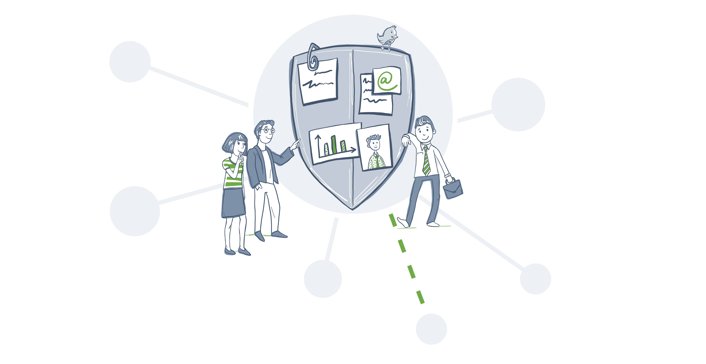
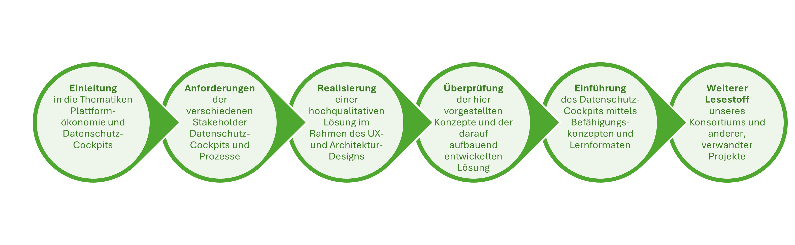

# Willkommen beim Projekt "D'accord"

 

<button type="button" id="toggleButton" style="background-color: #44546A; border: none; color: white; padding: 6px 12px; text-align: center; text-decoration: none; display: inline-block; font-size: 1rem;">Sitemap anzeigen</button>

	<ul id='contentList' class='collapsed'>
	  <li>Home</li>
	  <li><a href="Einleitung">Einleitung</a>
		<ul>
		  <li><a href="Einleitung/Digitale Plattformen und Plattformökonomie">Digitale Plattformen und Plattformökonomie</a></li>
		  <li><a href="Einleitung/Datenökonomie trifft Datenschutz">Datenökonomie trifft Datenschutz</a></li>
		  <li><a href="Einleitung/Datenverarbeitungen in digitalen Ökosystemen">Datenverarbeitungen in digitalen Ökosystemen</a>
			<ul>
			  <li><a href="Einleitung/Datenklassen">Datenklassen</a></li>
			  <li><a href="Einleitung/Verarbeitungszwecke">Verarbeitungszwecke</a></li>
			  <li><a href="Einleitung/Verarbeitungsarten">Verarbeitungsarten</a></li>
			</ul>
		  </li>
		  <li><a href="Einleitung/Glossar">Glossar</a></li>
		</ul>
	  </li>
	  <li><a href="Anforderungen/">Anforderungen</a>
		<ul>
		  <li><a href="Anforderungen/Zielgruppen">Zielgruppen</a>
			<ul>
			  <li><a href="Anforderungen/Zielgruppen/Stakeholder">Stakeholder</a></li>
			  <li><a href="Anforderungen/Zielgruppen/Personas">Personas</a></li>
			  <li><a href="Anforderungen/Zielgruppen/Mentale Modelle">Mentale Modelle</a></li>
			</ul>
		  </li>
		  <li><a href="Anforderungen/Randbedingungen">Randbedingungen</a></li>
		  <li><a href="Anforderungen/Bedarfe">Bedarfe</a>
			<ul>
			  <li><a href="Anforderungen/Bedarfe/Transparenzbedarfe">Transparenzbedarfe</a></li>
			  <li><a href="Anforderungen/Bedarfe/Selbstbestimmungsbedarfe">Selbstbestimmungsbedarfe</a></li>
			  <li><a href="Anforderungen/Bedarfe/Bedarfe der Datennutzer">Bedarfe der Datennutzer</a></li>
			  <li><a href="Anforderungen/Bedarfe/Unterstützungsbedarfe">Unterstützungsbedarfe</a></li>
			</ul>
		  </li>
		  <li><a href="Anforderungen/Anwendungsfälle">Anwendungsfälle</a></li>
		  <li><a href="Anforderungen/Qualitätsmodell">Qualitätsmodell</a></li>
		</ul>
	  </li>
	  <li><a href="Realisierung">Realisierung</a>
		<ul>
		  <li><a href="Realisierung/UX-Design">UX-Design</a>
			<ul>
			  <li><a href="Realisierung/UX-Design/Zentrale Datenschutz-Cockpits">Interaktionsdesigns für zentrale Datenschutz-Cockpits</a>
				<ul>
				  <li><a href="Realisierung/UX-Design/Zentrale Datenschutz-Cockpits/Datengeber">Datengeber</a></li>
				  <li><a href="Realisierung/UX-Design/Zentrale Datenschutz-Cockpits/Datennutzer">Datennutzer</a></li>
				</ul>
			  </li>
			  <li><a href="Realisierung/UX-Design/Eingebettete Datenschutzfunktionen">Interaktionsdesigns für eingebettete Datenschutzfunktionen</a></li>
			  <li><a href="Realisierung/UX-Design/Interaktionspatterns">Interaktionspatterns</a></li>
			</ul>
		  </li>
		  <li><a href="Realisierung/Architekturkonzept">Architekturkonzept</a>
			<ul>
			  <li><a href="Realisierung/Architekturkonzept/system-context">System context and domain model</a></li>
			  <li><a href="Realisierung/Architekturkonzept/drivers">Architecture drivers</a></li>
			  <li><a href="Realisierung/Architekturkonzept/decomposition">System decomposition</a></li>
			  <li><a href="Realisierung/Architekturkonzept/quality">Quality concepts</a></li>
			  <li><a href="Realisierung/Architekturkonzept/conclusion">Further notes</a></li>
			</ul>
		  </li>
		  <li><a href="Realisierung/Demonstratoren">Demonstratoren</a>
			<ul>
			  <li><a href="Realisierung/Demonstratoren/Smarte.Land.Regionen">Smarte.Land.Regionen</a></li>
			  <li><a href="Realisierung/Demonstratoren/Digitale Gesundheitsplattform">Digitale Gesundheitsplattform</a></li>
			  <li><a href="Realisierung/Demonstratoren/Kommunikationsplattform">Kommunikationsplattform</a></li>
			</ul>
		  </li>
		</ul>
	  </li>
	  <li><a href="Bewertung">Bewertung</a>
		<ul>
		  <li><a href="Bewertung(Evaluationskonzept">Evaluationskonzept</a></li>
		  <li><a href="Bewertung/Kriterienkataloge">Kriterienkataloge des D’accord-Qualitätsmodells</a></li>
		</ul>
	  </li>
	  <li><a href="Systemeinführung">Systemeinführung</a>
		<ul>
		  <li><a href="Systemeinführung/Einführungskonzept">Konzepte zur Einführung von Datenschutz-Cockpits</a></li>
		  <li><a href="Systemeinführung/Befähigungskonzept">Befähigungskonzept</a></li>
		  <li><a href="Systemeinführung/Lehr- und Lernformate">Lehr- und Lernformate</a></li>
		</ul>
	  </li>
	  <li><a href="Lesestoff">Weiterer Lesestoff</a>
		<ul>
		  <li><a href="Lesestoff">Unsere Veröffentlichungen</a></li>
		  <li><a href="Lesestoff/Veranstaltungen">Unsere Veranstaltungen</a></li>
		</ul>
	  </li>
	</ul>

##  Motivation

Digitale Plattformen und Ökosysteme werden immer populärer. Durch die COVID-19-Pandemie und die Verlagerung vieler Geschäftsmodelle ins Internet wurde dieser Trend nochmals verstärkt und auch kleinere Unternehmen bieten zunehmend digitale Dienste an. Allerdings ist das Potenzial noch größer, denn viele Unternehmen nehmen Datenschutz heute noch als digitale Innovationsbremse wahr. Es fehlt an Richtlinien, Werkzeugen und Lösungen, um die gesetzlichen Vorgaben, beispielsweise die Datenschutz-Grundverordnung, einfach und wirksam umzusetzen. Erschwerend kommt hinzu, dass die Umsetzung von Datenschutzvorgaben umso komplexer wird, je mehr Unternehmen beteiligt sind und je intensiver sie personenbezogene Daten austauschen. Bei Online-Bestellungen beispielsweise geben Händler die Daten zu den Bestellungen sowie den Kundinnen und Kunden oft an wechselnde Finanz- und Transportdienstleister weiter, die diese Daten ihrerseits an Subunternehmen übermitteln. Hier ist es für die Betroffenen aktuell nahezu unmöglich, sich ein umfassendes Bild über die tatsächliche Verwendung ihrer Daten zu verschaffen. Praxistaugliche Datenschutzkonzepte sind sowohl für Unternehmen als auch Bürgerinnen und Bürger wichtiger denn je.

##  Ziele 

Im Verbundvorhaben „D’accord – Adaptive Datenschutz-Cockpits in digitalen Ökosystemen“ wurden neuartige Konzepte und Werkzeuge entwickelt, mit denen Unternehmen bei der Verarbeitung personenbezogener Daten ein höheres Maß an Rechtssicherheit erreichen können, sowohl intern als auch unternehmensübergreifend. Im Zentrum steht ein sogenanntes Datenschutz-Cockpit. Diese Softwarelösung fungiert zum einen als zentrale Anlaufstelle für Betroffene, die sich über die Verwendung ihrer personenbezogenen Daten informieren wollen. Dies schafft Transparenz und Vertrauen. Zum anderen können die Betroffenen durch das Datenschutz-Cockpit aktiv Einfluss auf die Verwendung ihrer personenbezogenen Daten nehmen und ihre Betroffenenrechte ausüben.

##  Innovationen und Perspektiven

Kerninnovation des Vorhabens sind empirisch validierte Modelle sowie passende Konzepte und Technologien für Datenschutz-Cockpits. Mithilfe einer flexiblen Softwarelösung können Unternehmen, die vom Angebot digitaler Services oder der Teilhabe in digitalen Systemen profitieren möchten, Datenschutz-Cockpits für ihren spezifischen Kontext erstellen und implementieren. Auch kleinere Uanternehmen sind so in der Lage, Datenschutzrichtlinien und Datenflüsse transparenter darzustellen und die Betroffenenrechte rechtskonform umsetzen. Die Ergebnisse des D’accord-Vorhabens helfen auf diese Weise dabei, Datenschutz als Innovationsfaktor in der deutschen Unternehmenslandschaft weiter zu stärken.

##  Ergebnisse
In den folgenden Kapiteln führen wir Sie durch die Ergebnisse des Projekts. 

	
	
	
	
	
	
	

### ** Einleitung:** Worum geht es hier?

<mark>tbd.</mark>

[Zu den einleitenden Kapiteln](Einleitung/)

### ** Anforderungen:** Was muss ein Datenschutz-Cockpit können?

<mark>tbd.</mark>

[Zum Kapitel "Anforderungen"](Anforderungen/)

### ** Realisierung:** Wie kann man als Unternehmen Datenschutz-Cockpits realisieren?

<mark>tbd.</mark>

[Zum Kapitel "Realisierung"](Realisierung/)

### ** Überprüfung:** Wie kann man sich sicher sein, dass das alles funktioniert?

<mark>tbd.</mark>

[Zum Kapitel "Überprüfung"](Bewertung/)

### ** Systemeinführung:** Wie stellt man sicher, dass die Nutzer Datenschutz-Cockpits akzeptieren und verstehen?

<mark>tbd.</mark>

[Zum Kapitel "Systemeinführung"](<Systemeinführung/>)

### ** Weiterer Lesestoff:** Wo kann man mehr erfahren?

<mark>tbd.</mark>

Von uns publizierte Veröffentlichungen (Paper, Vorträge, Poster) finden Sie [hier](<Lesestoff/>).

Von uns durchgeführte Veranstaltungen finden Sie [hier](<Lesestoff/Veranstaltungen>).

## ** Autoren**

- **HK Business Solutions**
  - Hartmut Schmitt ([GitHub](https://github.com/HKBS-HS))
- **Fraunhofer IESE**
  - Denis Feth ([LinkedIn](https://www.linkedin.com/in/denis-feth/) \| [GitHub](https://github.com/denis-feth-iese))
  - Eddy Groen ([LinkedIn](https://www.linkedin.com/in/eddygroen/) \| [Google Scholar](https://scholar.google.com/citations?user=sMMCM1oAAAAJ&hl=en&oi=ao))
  - Patrick Müller 
  - Stefanie Ludborzs ([GitHub](https://github.com/StefanieLudborzs-IESE))
  - Dr. Rodrigo Falcão ([Webseite](https://rodrigofalcao.info))
- **Hochschule Bonn-Rhein-Sieg**
  - Prof. Dr. Luigi Lo Iacono
  - Florian Dehling ([GitHub](https://github.com/herr-dehling))
- **Insitut für Technologie und Arbeit**
  - Andreas Weßner
- **Universität des Saarlandes**
  - Prof. Dr. Christoph Sorge
  - Bianca Steffes
  - Franziska Neis
  - Maximilian Eichacker
  

## ** Danksagung**

Das Projekt D'accord wurde gefördert vom Bundesministerium für Bildung und Forschung (Förderkennzeichen 16KIS1506K, 16KIS1507, 16KIS1508, 16KIS1509, 16KIS1510). 

## ** Lizenz**
Die hier veröffentlichten Inhalte des Projekts [D'accord](https://fraunhofer-iese.github.io/Daccord) © 2024 von der [HK Business Solutions](https://www.hk-bs.de), dem [Fraunhofer IESE](https://www.iese.fraunhofer.de/), der [Hochschule Bonn-Rhein-Sieg](https://www.h-brs.de), dem [Insitut für Technologie und Arbeit](https://www.ita-kl.de) sowie der [Universität des Saarlandes](https://www.uni-saarland.de) stehen unter der [CC BY 4.0](http://creativecommons.org/licenses/by/4.0/?ref=chooser-v1)-Lizenz 

## ** Rechtliche Hinweise**
- [Datenschutzerklärung D'accord](https://daccord-projekt.de/WP/datenschutzerklaerung/)
- [Datenschutzerklärung GitHub](https://docs.github.com/de/site-policy/privacy-policies/github-privacy-statement)
- [Impressum](https://www.iese.fraunhofer.de/de/impressum.html)
